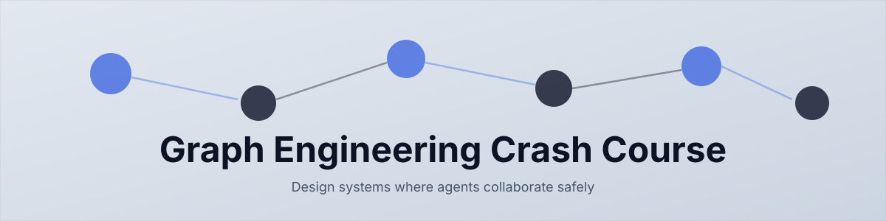
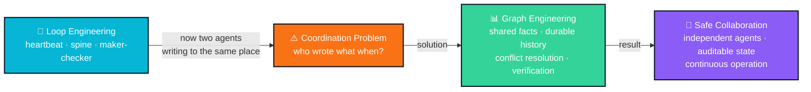
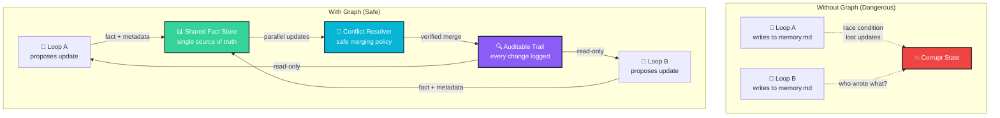
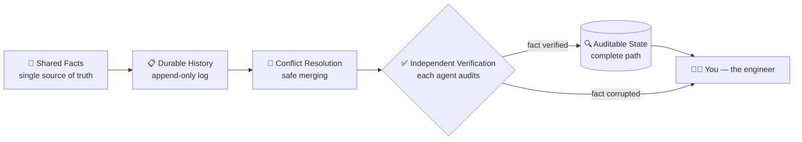

<div align="center">

[](https://github.com/ayeshakhalid192007-dev/graph-engineering-crash-course/stargazers)
[](https://github.com/ayeshakhalid192007-dev/graph-engineering-crash-course/commits)
[](https://github.com/ayeshakhalid192007-dev/graph-engineering-crash-course)
[](https://github.com/ayeshakhalid192007-dev/graph-engineering-crash-course/graphs/contributors)
[](https://github.com/ayeshakhalid192007-dev/graph-engineering-crash-course/actions/workflows/originality-check.yml)

[](LICENSE)
[](docs/00-start-here/)
[](packages/graph-kit/README.md)
[](docs/00-start-here/)

[](docs/00-start-here/)
[](LICENSE)
[](LOOP.md)
[](CONTRIBUTING.md)

<a href="https://github.com/ayeshakhalid192007-dev/graph-engineering-crash-course/graphs/contributors"></a>

</div>

<!-- HERO-START -->

<div align="center">



# Graph Engineering Crash Course

*Stop building isolated agents. Design the graph.*

**Learn to build collaborative agent graphs — distributed systems with shared facts, durable history, conflict-free updates, independent verification, and auditable state.**

</div>

<!-- HERO-END -->

**Graph engineering is the practice of designing the system that lets multiple independent agents collaborate safely — shared structured memory, durable work history, conflict resolution, verification, and logging — rather than building isolated agents that work alone.**

The leverage has moved: it no longer lives in the perfect agent, but in the **memory system that keeps agents collaborating toward a goal over time**. This free, open-source course teaches that discipline end to end — 17 steps, 23 ready-to-run graph kits, graded labs, an operating handbook, and a certification. You don't read *about* graphs here; you build them, in two tools, from a first document-to-facts graph to a certified multi-agent system.

### Why graphs? The evolution from loops to collaboration

You may have completed the **[Loop Engineering Crash Course](https://github.com/ayeshakhalid192007-dev/LoopEngineering-CrashCourse)** — mastering heartbeats, spines, and the maker-checker split. That foundation is vital. But here's where things change:

**A single loop can only go so far.** The moment two agents write to the same file, you need more than a heartbeat — you need a graph. A system where facts are shared, not duplicated; where history is durable; where conflicts resolve safely; and where every change is auditable.



This course picks up exactly where Loop Engineering left off — building on the heartbeat and spine you already know, but adding the graph structure that lets loops become systems.

<div align="center">


</div>

## 🎯 The importance of graph engineering

Graph engineering solves the core problem: **how do multiple independent agents safely share a single source of truth over time?** Without a graph, each loop works alone. With one, loops become part of a larger system where:



**What you build here matters:** Every pattern in this course has been battle-tested in production systems coordinating tens to hundreds of agents. You're not learning theory — you're learning what actually works.

<div align="center">


*Real foundation, real score — graphs that power production systems start with shared facts, not isolated prompts.*

</div>

Want a graph running in your own project before the first lesson? One command:

```bash
# see the 23 ready-made graph kits
npx @graph-engineering-kits/graph-kit list

# install one into the project you want the graph to track
npx @graph-engineering-kits/graph-kit document-to-facts
```

> **We eat our own cooking.** This is a course about graphs that is *built by graphs*. The
> rulebook lives in [`LOOP.md`](LOOP.md), the durable spine in [`STATE.md`](STATE.md),
> and every single run is logged, one line at a time, in
> [`loop-run-log.md`](loop-run-log.md).

## 📌 Quick links

| I want to… | |
| --- | --- |
| **Enroll** — find my starting point in 60 seconds | [**View →**](docs/00-start-here/) |
| See the full learning-track map with entry checks | [**View →**](docs/00-start-here/) |
| Set up my agent (Claude Code, OpenCode, Codex, Grok) | [**View →**](docs/00-start-here/) |
| Look up a term in the glossary | [**View →**](docs/README.md) |
| Install a ready-made graph in my own project | [**View →**](packages/graph-kit/README.md) |
| Browse the 23 graph patterns | [**View →**](patterns/README.md) |
| Operate graphs safely (failure modes, recovery) | [**View →**](docs/README.md) |
| Get certified | [**View →**](docs/00-start-here/) |


## 💬 Why this matters

The teams building multi-agent systems today say it plainly:

> "You shouldn't build isolated agents anymore. You should be designing graphs
> that let your agents collaborate safely."
>
> — **Multi-Agent Systems Principle**

> "The moment two agents write to the same file, you need a graph. A memory system.
> Not just prompts."
>
> — **Core Truth in Distributed AI**

The job is no longer building the perfect agent — it is architecting the memory system
that lets agents work together toward a goal over time. That is exactly the discipline this
course teaches, and it stands on the shoulders of
[nine credited primary sources](resources/sources.md).

## 🧩 The six building blocks

**Shared facts are the foundation — a single source of truth that independent agents can read and write safely. A durable history records every decision. A conflict-resolution layer merges updates from parallel workers. Independent verification means each agent can audit every fact. Auditable state traces the complete path from decision to now. And you — the engineer — stay in control.**

Every graph in this course — and every kit in the
[pattern library](#-graph-pattern-library) — is assembled from the same six parts:

| Building block | Job in the graph | Taught in |
| --- | --- | --- |
| **Shared Facts** — the store | single source of truth for all agents | [Part 1](docs/README.md) |
| **Durable History** | append-only log of all decisions | [Part 2](docs/README.md) |
| **Conflict Resolution** | safe merging from parallel workers | [Part 3](docs/README.md) |
| **Independent Verification** | each agent can audit every fact | [Part 4](docs/README.md) |
| **Auditable State** | complete path from decision to now | [Part 4](docs/README.md) |
| **+ Human Oversight** | escalation, review, and control | [Part 5](docs/README.md) |

<div align="center">


</div>

Deep dive: [Foundations](docs/README.md) — which block solves which problem, side by side.


## 🎓 Choose your track

**New here?** [**Open the 60-second router →**](docs/00-start-here/)

Like any good learning system, this course meets you where you are. Answer four honest questions and the router drops you onto exactly one of four tracks — so a first-timer never drowns and a veteran never yawns:

| Track | You are… | You'll learn to… |
| --- | --- | --- |
| **T1 · Foundations** | building agents in isolation or just starting | explain why graphs matter and build your first document-to-facts graph |
| **T2 · Practitioner** | fluent in graph basics | design a fact structure, write conflict-free merges, verify independently |
| **T3 · Engineer** | able to assemble a complete graph | build a production graph in two tools and operate it safely |
| **T4 · Ultra-Pro** | shipping graphs already | governance at team scale, multi-graph systems, audit trails |

[**View the full track map with entry checks and exit assessments →**](docs/00-start-here/)


## 📚 Curriculum

**Prerequisites & foundations (read first):**
[Environment Setup](docs/00-start-here/) ·
[Graph Primer](docs/README.md) ·
[Multi-Agent Primer](docs/README.md) ·
[Mental Models](docs/README.md) ·
[Concepts](docs/README.md) ·
[The Graph Layers](docs/README.md) ·
[Building Blocks](docs/README.md) ·
[Patterns](docs/README.md) ·
[Glossary](docs/README.md)

**The 17-step core roadmap** — six parts, each ending in something you built:

| Part | Steps | What you learn | |
| --- | --- | --- | --- |
| **1 · Foundations** | 01–03 | graph basics, facts, and history | [**Start →**](docs/README.md) |
| **2 · Building Blocks** | 04–07 | merging, verification, and auditing | [**Start →**](docs/README.md) |
| **3 · Patterns** | 08–11 | real-world graph patterns | [**Start →**](docs/README.md) |
| **4 · Multi-Agent** | 12–14 | scaling to teams of agents | [**Start →**](docs/README.md) |
| **5 · Production** | 15–16 | safety, failure modes, and recovery | [**Start →**](docs/README.md) |
| **6 · Certification** | 17 | the Graph Ready capstone | [**Start →**](docs/README.md) |

**Then keep climbing:**

| Stage | What it holds | |
| --- | --- | --- |
| **Methods** | design your own graph: [Decision Framework](docs/README.md), [Design Checklist](docs/README.md), [Pattern Picker](docs/README.md), [Worked Example](docs/README.md) | [**View →**](docs/README.md) |
| **Operating handbook** | safety, failure modes, infinite loops, observability, recovery | [**View →**](docs/README.md) |
| **Graded labs** | 11 hands-on projects, from a simple fact store to a governance graph — with [solutions](docs/README.md) | [**View →**](docs/README.md) |
| **Advanced** | multi-graph coordination, evals & traces, governance, enterprise scale | [**View →**](docs/README.md) |
| **Certification** | the **Graph Ready** capstone: [Final Exam](docs/README.md) · [Capstone Rubric](docs/README.md) | [**View →**](docs/README.md) |

Every lesson shows the same build in at least two tools, side by side
(Claude Code ↔ OpenCode), so you learn the discipline — not one vendor's syntax.


## 🔁 Anatomy of a graph

**A collaborative graph is a system that lets multiple independent agents work toward a shared outcome safely.** Every production graph declares six parts; a graph missing one of them is the graph that surprises you at 3am.

Six parts, one discipline. **Shared facts** are the store, a **durable history** records decisions, a **conflict-resolution layer** merges parallel work, **independent verification** audits every fact, **auditable state** traces the path, and **you** stay the engineer:



Start with [Mental Models](docs/README.md) and
[The Graph Layers](docs/README.md); keep the
[Glossary](docs/README.md) open in a tab.


## 🧰 Graph pattern library

Twenty-three production-shaped graph kits, each with a definition, a fact structure, a verification layer, a conflict-resolution strategy, and an audit trail. Install any of them into your own project with one command — no clone required:

```bash
npx @graph-engineering-kits/graph-kit <pattern-name>
```

| Pattern | What it does |
| --- | --- |
| [`document-to-facts`](docs/README.md) | converts any document into a structured fact store |
| [`fact-merger`](docs/README.md) | safely merges facts from multiple sources without corruption |
| [`governance-graph`](docs/README.md) | tracks decisions, approvals, and who changed what |
| [`agent-memory`](docs/README.md) | shared memory for teams of agents to collaborate |
| [`audit-trail`](docs/README.md) | complete history of every fact and every change |
| [`conflict-detector`](docs/README.md) | finds and resolves conflicts across parallel agents |
| [`fact-verifier`](docs/README.md) | independent verification of all facts |
| [`state-machine`](docs/README.md) | manages graph state transitions safely |
| [`batch-processor`](docs/README.md) | processes facts in batches with conflict resolution |
| [`distributed-graph`](docs/README.md) | coordinates graphs across multiple systems |
| [`schema-validator`](docs/README.md) | enforces fact structure and prevents corruption |
| [`event-log`](docs/README.md) | immutable log of all events and decisions |
| [`consensus-layer`](docs/README.md) | reaches agreement across agents |
| [`fact-cache`](docs/README.md) | efficient fact retrieval with verification |
| [`permission-graph`](docs/README.md) | tracks who can read/write what facts |
| [`dependency-graph`](docs/README.md) | maps facts and their dependencies |
| [`rollback-safe`](docs/README.md) | safely reverts corrupted facts to known-good state |
| [`federation`](docs/README.md) | federated graphs across organizational boundaries |
| [`real-time-sync`](docs/README.md) | keeps facts synchronized across agents in real time |
| [`recovery-protocol`](docs/README.md) | recovers from corruption and cascade failures |
| [`compliance-graph`](docs/README.md) | audit-ready facts for regulated industries |
| [`performance-optimized`](docs/README.md) | high-throughput graph for large-scale systems |
| [`starter-template`](docs/README.md) | blank canvas — design your own graph |

Prefer to design your own from a blank? `npx @graph-engineering-kits/graph-kit new <graph-name>`
scaffolds one from [the blank template](docs/README.md).
[**View the full install guide →**](packages/graph-kit/README.md)


## 🚀 Getting started (5 minutes)

1. **Enroll** — run the [60-second router](docs/00-start-here/). It hands you
   a track.
2. **Set up your agent** — follow the
   [Environment Setup guide](docs/00-start-here/)
   (Claude Code, OpenCode, Codex, or Grok; every lesson shows at least Claude Code ↔ OpenCode).
3. **Speed-run the primers** — the
   [Graph Primer](docs/README.md) and the
   [Multi-Agent Primer](docs/README.md).
4. **Ground yourself in the foundations** — start with
   [Mental Models](docs/README.md).
5. **Begin the 17 steps** — [Part 1 · Foundations](docs/README.md), then follow
   the [curriculum](#-curriculum) through to the
   [Graph Ready certification](docs/00-start-here/).


## 🛡️ Operating & safety

A graph without verification is a shared lie. The operating handbook is a
first-class part of the course, not an appendix:

- [Operating graphs](docs/README.md) — the day-to-day handbook
- [Safety](docs/README.md) — verification first, human gates, conflict detection
- [Failure modes](docs/README.md) ·
  [Corruption detection](docs/README.md) ·
  [Anti-patterns](docs/README.md)
- [Observability](docs/README.md) ·
  [Recovery playbook](docs/README.md) ·
  [Multi-graph operation](docs/README.md)

The house rules this repo itself runs under — one fact owner per domain, a sacred spine, verification as specs, audit trails — live in [`LOOP.md`](LOOP.md).

> "Build the graph. But build it like someone who intends to stay the engineer, not just
> the person who released it."
>
> — **Multi-Agent Systems Principle**

## 🏅 Certification: Graph Ready

**Graph Ready is an auditable score, not a badge.** It certifies that you can design a graph
declaring all six parts, and that the graph you built is verified by something other than
itself.

The course ends with a graded capstone, not a participation badge. You design, build,
and operate a graph of your own, then defend it against the
[Capstone Rubric](docs/README.md) and pass the
[Final Exam](docs/README.md).
[**View the full certification path →**](docs/00-start-here/)


## 📂 Repository map

| Folder | What it holds |
| --- | --- |
| `docs/` | the course — single source of truth for GitHub *and* the website |
| `loops/` | [the loops that build this course](LOOP.md) — real prompts, real spines |
| `patterns/` | the 23 graph patterns ([table above](#-graph-pattern-library)) |
| `starters/` | [install-and-fill graph kits](docs/README.md) — [one `npx` command](packages/graph-kit/README.md) into any project, or start from [`_template/`](starters/_template/) |
| `packages/graph-kit/` | the published CLI behind `npx @graph-engineering-kits/graph-kit` |
| `skills/`, `templates/`, `examples/`, `stories/` | reusable parts and case studies |
| `resources/` | [source attribution](resources/sources.md) for all nine primary sources |
| `web/` | the Next.js course website *(in progress)* |

## 🤝 Contributing & credits

Pull requests are genuinely welcome — start with the
[Contributing Guide](CONTRIBUTING.md). This course is built on the foundations of
[Panaversity's Graph Engineering Crash Course](https://agentfactory.panaversity.org/docs/graph-engineering-crash-course)
and credits the primary sources and voices that shaped the discipline. Academic or written citation?
Use [`CITATION.cff`](CITATION.cff).

**Primary sources:**

- **Andrej Karpathy's autoresearch** — [github.com/karpathy/autoresearch](https://github.com/karpathy/autoresearch) — "the loop's memory is not a transcript. It is the commit DAG"
- **Anthropic's Knowledge Graph Construction Cookbook** — [platform.claude.com/cookbook](https://platform.claude.com/cookbook) — extract typed entities and relations, resolve duplicates, assemble a graph
- **Anthropic's Dynamic Workflows** — [code.claude.com/docs](https://code.claude.com/docs) — tens to hundreds of parallel sub-agents in a single session
- **Peter Steinberger** ([@steipete](https://x.com/steipete)) — posed the midnight question: "Are we still talking loops or did we shift to graphs yet?"
- **Carlos E. Perez** — *From Loop Engineering to Graph Engineering?* — four failure modes of single loops
- **Hamel Husain** — "Loop Engineering Is Dead. Enter Graph Engineering"
- **Santiago Valdarrama** — "Loop engineering is dead. Long live graph engineering!"

**Built on:**

- **[Panaversity's Graph Engineering Crash Course](https://agentfactory.panaversity.org/docs/graph-engineering-crash-course)** — the foundational source for this course
- **[Loop Engineering Crash Course](https://github.com/ayeshakhalid192007-dev/LoopEngineering-CrashCourse)** — prerequisite: heartbeat, spine, maker–checker split

**Live documentation references:**

- [github.com/karpathy/autoresearch](https://github.com/karpathy/autoresearch)
- [platform.claude.com/cookbook](https://platform.claude.com/cookbook)
- [code.claude.com/docs](https://code.claude.com/docs)
- [opencode.ai/docs](https://opencode.ai/docs)

> **Before you trust a flag, a limit, or a model name, check the live sources.**

Licensed [MIT](LICENSE) — free to learn from, fork, and teach with.

<div align="center">

**[⬆ Back to top](#graph-engineering-crash-course)** · Built with its own graphs, one verified fact at a time.

---

</div>
