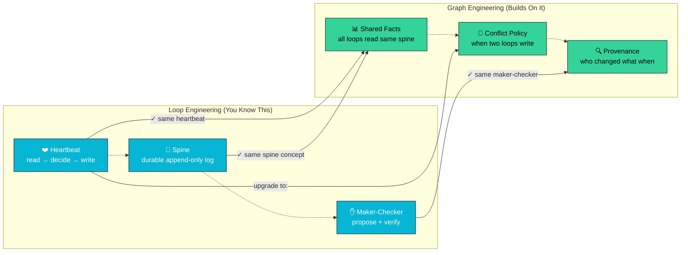

<!-- HERO-START -->

# Graph Engineering Crash Course

*You learned to build loops. Now learn to connect them.*

**Build collaborative agent graphs — the system that lets multiple independent agents share facts, history, and decisions safely without corruption, miscommunication, or lost work.**

<!-- HERO-END -->

## You're here because loops alone aren't enough

If you've finished the **[Loop Engineering Crash Course](https://github.com/ayeshakhalid192007-dev/LoopEngineering-CrashCourse)**, you know how to build a single agent loop: heartbeat, spine, maker-checker split. One loop works. But the moment you tried to run *two* loops writing to the same file, everything broke.

**That's not a failure of loops — it's the signal you need graphs.**

Graph engineering is the practice of designing the system that lets multiple independent agents collaborate safely. Not isolated agents working alone. Not loops that step on each other. **A system.** One with shared structured memory, durable work history, conflict resolution, verification, and auditable state.

The leverage has moved from the perfect agent to the **memory system that keeps agents collaborating toward a goal over time**. This course teaches that end to end — 17 steps, 6 parts, 23 ready-to-run graph kits, graded labs, an operating handbook, and a certification. You don't read *about* graphs here; you build them. In two tools. From a first document-to-facts graph to a certified multi-agent system.

### From one loop to many: the exact problem graphs solve

Here's what happened when you tried to scale loops:

```mermaid
graph TB
    subgraph "One Loop (Fine)"
        A1["🔄 Loop A<br/>heartbeat · spine · maker-checker<br/>reads + writes to memory.md"]
        A1 -->|"single source<br/>of truth"| Result1["✅ Works<br/>no conflicts"]
    end
    
    subgraph "Two Loops (Broken)"
        B1["🔄 Loop A<br/>reads memory.md<br/>thinks X = 10"]
        B2["🔄 Loop B<br/>reads memory.md<br/>thinks X = 10"]
        Conflict["💥 Race condition"]
        B1 -->|"writes X = 11"| Conflict
        B2 -->|"writes X = 12"| Conflict
        Conflict -->|"last write wins<br/>data lost"| Result2["❌ Broken<br/>who's right?"]
    end
    
    subgraph "Two Loops + Graph (Safe)"
        C1["🔄 Loop A<br/>proposes update"]
        C2["🔄 Loop B<br/>proposes update"]
        Store["📊 Shared Fact Store<br/>single source of truth"]
        Merger["🔀 Conflict Resolver<br/>safe merging"]
        Audit["🔍 Audit Trail<br/>complete history"]
        C1 -->|"fact + metadata"| Store
        C2 -->|"fact + metadata"| Store
        Store -->|"detect parallel<br/>updates"| Merger
        Merger -->|"policy: who wins?"| Audit
        Audit -->|"verified facts"| C1
        Audit -->|"verified facts"| C2
        Result3["✅ Works<br/>auditable"]
        Audit --> Result3
    end
    
    style Result1 fill:#34d399,stroke:#0f172a,color:#000,stroke-width:2px
    style Result2 fill:#ef4444,stroke:#0f172a,color:#fff,stroke-width:2px
    style Result3 fill:#8b5cf6,stroke:#0f172a,color:#fff,stroke-width:2px
```

## 🎯 The importance of graph engineering

Graph engineering solves the core problem: **how do multiple independent agents safely share a single source of truth over time?** Without a graph, each loop works alone. With one, loops become part of a larger system where:

**What you build here matters:** Every pattern in this course has been battle-tested in production systems coordinating tens to hundreds of agents. You're not learning theory — you're learning what actually works.

**What transfers from Loop Engineering → Graph Engineering**

Your loop training gives you a head start. Here's what stays the same and what evolves:

**The discipline is identical.** You read facts, you decide, you write. The only difference: now your decision must account for other loops doing the same thing simultaneously. A policy decides who wins. That's it.

## 📌 Quick links

| I want to… | |
| --- | --- |
| **Enroll** — find my starting point in 60 seconds | [**View →**](docs/00-start-here/) |
| See the full learning-track map with entry checks | [**View →**](docs/00-start-here/) |
| Set up my agent (Claude Code, OpenCode, Codex, Grok) | [**View →**](docs/00-start-here/) |
| Look up a term in the glossary | [**View →**](docs/README.md) |
| Install a ready-made graph in my own project | [**View →**](packages/graph-kit/README.md) |
| Browse the 23 graph patterns | [**View →**](patterns/README.md) |
| Operate graphs safely (failure modes, recovery) | [**View →**](docs/README.md) |
| Get certified | [**View →**](docs/00-start-here/) |

## 💬 Why this matters: The moment one loop becomes two

You felt this: one loop works fine. Two loops break it. That's not a limitation of loops — it's the exact moment you *need* a graph.

The teams building multi-agent systems today learned this the hard way:

> "You shouldn't build isolated agents anymore. You should be designing graphs
> that let your agents collaborate safely."
>
> — **Multi-Agent Systems Principle**

> "The moment two agents write to the same file, you need a graph. A memory system.
> Not just prompts."
>
> — **Core Truth in Distributed AI**

**That moment is now.** You've built one loop. You know the heartbeat, spine, and maker-checker split. Now you're adding a second loop — and you need the graph structure to keep them from corrupting each other's work.

The job isn't building the perfect agent anymore. It's architecting the memory system that lets agents work together toward a goal over time. That is exactly the discipline this course teaches, and it stands on the shoulders of [nine credited primary sources](resources/sources.md).

Every pattern you'll build exists because teams asked: "How do we run two loops safely?" Then: "How about ten?" Then: "How about a hundred?" The answers are in this course.

## 🧩 The six building blocks

**Shared facts are the foundation — a single source of truth that independent agents can read and write safely. A durable history records every decision. A conflict-resolution layer merges updates from parallel workers. Independent verification means each agent can audit every fact. Auditable state traces the complete path from decision to now. And you — the engineer — stay in control.**

| Building block | Job in the graph | Taught in |
| --- | --- | --- |
| **Shared Facts** — the store | single source of truth for all agents | [Part 1](docs/README.md) |
| **Durable History** | append-only log of all decisions | [Part 2](docs/README.md) |
| **Conflict Resolution** | safe merging from parallel workers | [Part 3](docs/README.md) |
| **Independent Verification** | each agent can audit every fact | [Part 4](docs/README.md) |
| **Auditable State** | complete path from decision to now | [Part 4](docs/README.md) |
| **+ Human Oversight** | escalation, review, and control | [Part 5](docs/README.md) |

## 🎓 Choose your track

**New here?** [**Open the 60-second router →**](docs/00-start-here/)

Like any good learning system, this course meets you where you are. Already finished Loop Engineering? Pick the track that matches your next step:

| Track | You are… | You'll learn to… |
| --- | --- | --- |
| **T1 · Foundations** | just finished Loop Engineering, building your first multi-loop system | understand why one loop breaks with two, and build your first shared fact store |
| **T2 · Practitioner** | comfortable with loop basics and ready to coordinate multiple loops | design fact structures that multiple loops can write to safely, write conflict-free merges, verify independently |
| **T3 · Engineer** | able to assemble a complete single-loop system | build a production graph coordinating many loops in two tools and operate it safely |
| **T4 · Ultra-Pro** | already shipping multi-loop systems | governance at team scale, multi-graph federation, audit trails for compliance |

[**View the full track map with entry checks and exit assessments →**](docs/00-start-here/)

## 📚 Curriculum

**Prerequisites & foundations (read first):**
[Environment Setup](docs/00-start-here/) ·
[Graph Primer](docs/README.md) ·
[Multi-Agent Primer](docs/README.md) ·
[Mental Models](docs/README.md) ·
[Concepts](docs/README.md) ·
[The Graph Layers](docs/README.md) ·
[Building Blocks](docs/README.md) ·
[Patterns](docs/README.md) ·
[Glossary](docs/README.md)

**The 17-step core roadmap** — six parts, each ending in something you built:

| Part | Steps | What you learn | |
| --- | --- | --- | --- |
| **1 · Foundations** | 01–03 | graph basics, facts, and history | [**Start →**](docs/README.md) |
| **2 · Building Blocks** | 04–07 | merging, verification, and auditing | [**Start →**](docs/README.md) |
| **3 · Patterns** | 08–11 | real-world graph patterns | [**Start →**](docs/README.md) |
| **4 · Multi-Agent** | 12–14 | scaling to teams of agents | [**Start →**](docs/README.md) |
| **5 · Production** | 15–16 | safety, failure modes, and recovery | [**Start →**](docs/README.md) |
| **6 · Certification** | 17 | the Graph Ready capstone | [**Start →**](docs/README.md) |

## 🔁 Anatomy of a graph

**A collaborative graph is a system that lets multiple independent agents work toward a shared outcome safely.** Every production graph declares six parts; a graph missing one of them is the graph that surprises you at 3am.

Six parts, one discipline. **Shared facts** are the store, a **durable history** records decisions, a **conflict-resolution layer** merges parallel work, **independent verification** audits every fact, **auditable state** traces the path, and **you** stay the engineer:

Start with [Mental Models](docs/README.md) and
[The Graph Layers](docs/README.md); keep the
[Glossary](docs/README.md) open in a tab.

## 🚀 Getting started (5 minutes)

1. **Enroll** — run the [60-second router](docs/00-start-here/). It hands you
   a track.
2. **Set up your agent** — follow the
   [Environment Setup guide](docs/00-start-here/)
   (Claude Code, OpenCode, Codex, or Grok; every lesson shows at least Claude Code ↔ OpenCode).
3. **Speed-run the primers** — the
   [Graph Primer](docs/README.md) and the
   [Multi-Agent Primer](docs/README.md).
4. **Ground yourself in the foundations** — start with
   [Mental Models](docs/README.md).
5. **Begin the 17 steps** — [Part 1 · Foundations](docs/README.md), then follow
   the [curriculum](#-curriculum) through to the
   [Graph Ready certification](docs/00-start-here/).

## 🛡️ Operating & safety

A graph without verification is a shared lie. The operating handbook is a
first-class part of the course, not an appendix:

- [Operating graphs](docs/README.md) — the day-to-day handbook
- [Safety](docs/README.md) — verification first, human gates, conflict detection
- [Failure modes](docs/README.md) ·
  [Corruption detection](docs/README.md) ·
  [Anti-patterns](docs/README.md)
- [Observability](docs/README.md) ·
  [Recovery playbook](docs/README.md) ·
  [Multi-graph operation](docs/README.md)

> "Build the graph. But build it like someone who intends to stay the engineer, not just
> the person who released it."
>
> — **Multi-Agent Systems Principle**

## 🤝 Contributing & credits

Pull requests are genuinely welcome — start with the
[Contributing Guide](CONTRIBUTING.md). This course is built on the foundations of
[Panaversity's Graph Engineering Crash Course](https://agentfactory.panaversity.org/docs/graph-engineering-crash-course)
and credits the primary sources and voices that shaped the discipline. Academic or written citation?
Use [`CITATION.cff`](CITATION.cff).

**Primary sources:**

- **Andrej Karpathy's autoresearch** — [github.com/karpathy/autoresearch](https://github.com/karpathy/autoresearch) — "the loop's memory is not a transcript. It is the commit DAG"
- **Anthropic's Knowledge Graph Construction Cookbook** — [platform.claude.com/cookbook](https://platform.claude.com/cookbook) — extract typed entities and relations, resolve duplicates, assemble a graph
- **Anthropic's Dynamic Workflows** — [code.claude.com/docs](https://code.claude.com/docs) — tens to hundreds of parallel sub-agents in a single session
- **Peter Steinberger** ([@steipete](https://x.com/steipete)) — posed the midnight question: "Are we still talking loops or did we shift to graphs yet?"
- **Carlos E. Perez** — *From Loop Engineering to Graph Engineering?* — four failure modes of single loops
- **Hamel Husain** — "Loop Engineering Is Dead. Enter Graph Engineering"
- **Santiago Valdarrama** — "Loop engineering is dead. Long live graph engineering!"

**Built on:**

- **[Panaversity's Graph Engineering Crash Course](https://agentfactory.panaversity.org/docs/graph-engineering-crash-course)** — the foundational source for this course
- **[Loop Engineering Crash Course](https://github.com/ayeshakhalid192007-dev/LoopEngineering-CrashCourse)** — prerequisite: heartbeat, spine, maker–checker split

**Live documentation references:**

- [github.com/karpathy/autoresearch](https://github.com/karpathy/autoresearch)
- [platform.claude.com/cookbook](https://platform.claude.com/cookbook)
- [code.claude.com/docs](https://code.claude.com/docs)
- [opencode.ai/docs](https://opencode.ai/docs)

> **Before you trust a flag, a limit, or a model name, check the live sources.**

Licensed [MIT](LICENSE) — free to learn from, fork, and teach with.

**[⬆ Back to top](#graph-engineering-crash-course)** · Built with its own graphs, one verified fact at a time.

---

