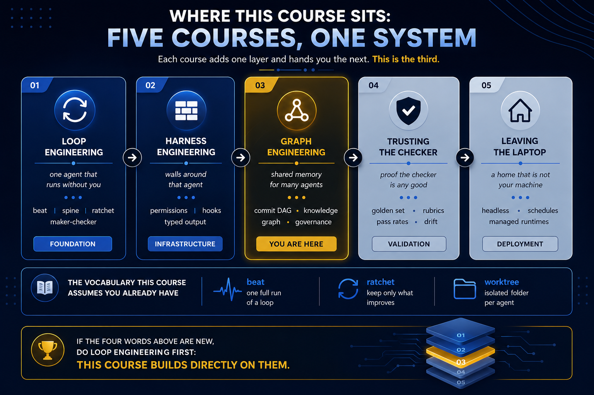

# Start Here

---

Three quick questions to find your starting point.

## 1. Loop Engineering prerequisite?

Can you explain what makes a file a loop's "spine" and why a heartbeat isn't the same as self-grading?

- **Yes** → Continue to question 2
- **Not sure** → Read the [Loop Engineering Primer](../01-prerequisites/loop-engineering-primer.md) first

## 2. Harness Engineering prerequisite?

Can you explain the difference between verifying and correcting an agent's output?

- **Yes** → Continue to question 3
- **Not sure** → Read the [Harness Engineering Primer](../01-prerequisites/harness-engineering-primer.md) first

## 3. What brings you here?

**Multiple loops stepping on each other?**  
→ Start with [Part 1: The Memory Problem](../03-part-1-the-memory-problem/)

**Not sure if you need a graph?**  
→ Jump to [Part 7: Staying Grounded](../09-part-7-staying-grounded/)

**Just want definitions?**  
→ Check the [Foundations](../02-foundations/README.md) section
