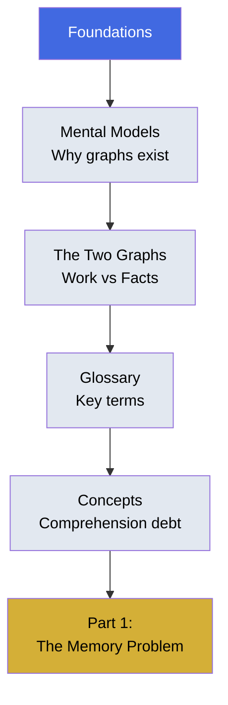

# Foundations

Core vocabulary and concepts for graph engineering. This section establishes the mental models and terminology used throughout the entire course.

## What You'll Learn

Build a solid foundation before diving into implementation:

- Why graphs exist and when they replace simpler tools
- The critical distinction between work-history and fact graphs
- Key terminology used throughout the course
- How comprehension debt accumulates in shared structures

## Contents

1. **[Mental Models](mental-models.md)** — Visualizing shared memory vs. solo work
2. **[The Two Graphs](the-two-graphs.md)** — Why work-history and facts must stay separate
3. **[Glossary](glossary.md)** — Precise definitions for all key terms
4. **[Concepts](concepts.md)** — Comprehension debt and team understanding

## Diagram

## Learning Thread

**Start here** if you're new to graph engineering. This section answers "what is a graph and why would I need one?" before any code appears.

**Suggested path**: Read mental models → the two graphs → skim glossary → read concepts. Return to the glossary as a reference when you encounter unfamiliar terms later.

## Check Your Understanding

Can you now:

- ✓ Explain why a single memory file works for one loop but fails for two
- ✓ Distinguish between work-history graphs and fact graphs
- ✓ Define: node, edge, extraction, resolution, provenance
- ✓ Recognize when comprehension debt is accumulating

**Ready?** Continue to [Part 1 - The Memory Problem](../03-part-1-the-memory-problem/)
