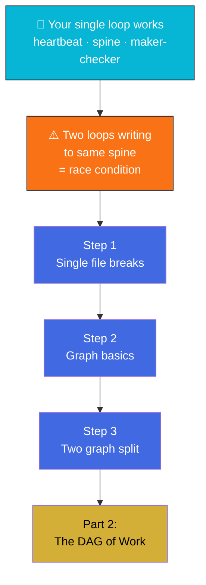

# Part 1 — The Memory Problem

The exact moment your loop breaks and why graphs fix it.

## What You'll Learn

This is where Loop Engineering meets Graph Engineering. You've built one loop with a spine. Now you try to run two. And everything breaks.

Understand the fundamental problem graph engineering solves:

- When and why a single memory file fails with two writers (the race condition you've felt)
- How nodes and edges create structured shared memory
- Why work-history and fact graphs serve different purposes

## Contents

1. **[Step 1](01-why-loops-outgrow-a-single-memory-file.md)** — When two loops race to the same file
2. **[Step 2](02-graphs-in-plain-terms.md)** — Nodes and edges: the basics
3. **[Step 3](03-keep-your-two-graphs-separate.md)** — Why work-history and facts need separate graphs

## Diagram

## Learning Thread

**Prerequisites**: You should be comfortable with loop engineering vocabulary (heartbeat, spine, maker/checker) from the Loop Engineering Crash Course.

**Why this part matters**: This is where single-loop thinking breaks. You'll recognize the exact moment when a flat file needs to become a graph, and understand why attempts and facts can't share the same structure.

**What this unlocks**: You'll recognize the exact moment when a flat file needs to become a graph, and understand why attempts and facts can't share the same structure.

## Practice

- [Quiz](quiz.md) — Check knowledge
- [Flashcards](flashcards.md) — Review terms

## Skills Assessment

Can you:

- ✓ Identify the race condition that breaks single-file memory with two loops
- ✓ Explain what makes an edge "directed" and "labeled"
- ✓ Distinguish work-history graph from fact graph by purpose
- ✓ Predict when merging the two graphs causes problems

**Ready?** Continue to [Part 2 - The DAG of Work](../04-part-2-the-dag-of-work/)
