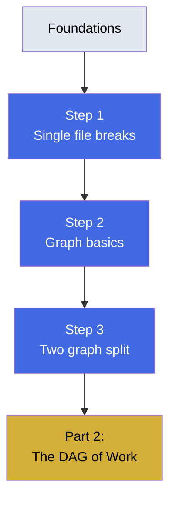

# Part 1 — The Memory Problem

The moment a single memory file breaks and why graphs fix it. This part shows exactly where the thin-memory trick stops working.

## What You'll Learn

Understand the fundamental problem graph engineering solves:

- When and why a single file fails with multiple writers
- How nodes and edges create structured shared memory
- Why work-history and fact graphs serve different purposes

## Contents

1. **[Step 1](step-1-why-loops-outgrow-a-single-memory-file.md)** — When two writers race to the same file
2. **[Step 2](step-2-graphs-in-plain-terms.md)** — Nodes and edges: the basics
3. **[Step 3](step-3-keep-your-two-graphs-separate.md)** — Why work-history and facts need separate graphs

## Diagram

## Learning Thread

**Prerequisites**: Complete the Foundations section first. You should be comfortable with loop engineering vocabulary (heartbeat, spine, maker/checker).

**What this unlocks**: After this part, you'll recognize the exact moment when a flat file needs to become a graph, and you'll understand why attempts and facts can't share the same structure.

## Practice

- [Quiz](quiz.md) — Test your understanding
- [Flashcards](flashcards.md) — Review key concepts

## Check Your Understanding

After completing this part, you should be able to:

- ✓ Identify the race condition that breaks single-file memory
- ✓ Explain what makes an edge "directed" and "labeled"
- ✓ Distinguish work-history graph from fact graph by purpose
- ✓ Predict when merging the two graphs causes problems

**Ready?** Continue to [Part 2 - The DAG of Work](../04-part-2-the-dag-of-work/)
