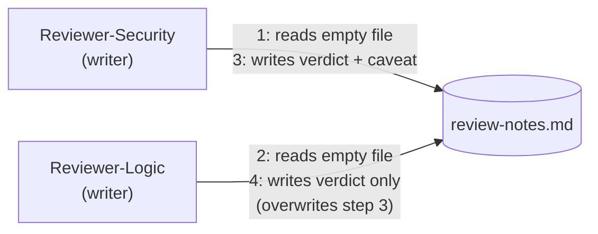

# Step 1 · When a Single Memory File Stops Being Enough

## Hook

A pull request touching a login rate limiter goes up for review, and the harness fans it out to two reviewer agents at once: `Reviewer-Security` checks for injection and auth bypass risks, `Reviewer-Logic` checks that the business logic still does what the ticket asked for. Both write their verdict to the same shared file, `review-notes.md` — read the current notes, add a line, save. `Reviewer-Security` finishes first: it decides the change is safe, but only because the rate limiter middleware stays enabled above this endpoint, and it writes that caveat into the file. A few seconds later `Reviewer-Logic` finishes too. It never saw `Reviewer-Security`'s update — it loaded the file before that write landed — so its own "safe" verdict gets appended to the version *it* remembers, and that whole file gets saved back over the top. The caveat is gone. Nobody deleted it on purpose. Nobody will notice until the rate limiter gets disabled in some unrelated change three weeks later and the "safe" verdict everyone still trusts turns out to have been conditional the whole time.

## Explanation

A single automated loop can get away with almost no memory infrastructure at all — just one plain file it reads when it wakes up and rewrites before it goes back to sleep. Call this the **[thin-memory trick](../02-foundations/glossary.md#thin-memory-trick)**: one loop, one file, one reader, one writer, and that reader and writer are never active on the file at the same moment, because they're the same process taking turns. Under those conditions a flat file is not a shortcut you'll regret — it's genuinely the right amount of infrastructure for the job, and reaching for anything heavier would be waste.

The trick has a hidden condition baked into it, though: it only holds while there is exactly one loop touching the file. The moment a second reviewer, a second worker, a second anything starts reading or writing that same file, two specific things start going wrong, and they're different failures, not the same one twice.

The first is what happened to `review-notes.md` above: **two writers can clobber each other's update.** Each agent reads the file, decides what to add based on what it read, and writes its own full copy back. Whichever write lands second wins completely — not "mostly," not "except for the parts that don't conflict." A single flat file has no concept of merging two changes; it only has "the last write," and everything the second writer didn't happen to carry forward from the first writer's version simply stops existing.

The second failure doesn't even need two writers active at once — it shows up whenever a later reader can't tell what state a claim is in. Suppose a third agent opens `review-notes.md` a minute after the collision above and reads "verdict: safe." That sentence looks identical whether it means "both reviewers independently confirmed this is safe" or "one reviewer typed this before finishing the check and got interrupted." A flat file has no way to carry that distinction — a **settled fact** and a **half-finished guess** are stored in exactly the same format, plain text in a shared document, and nothing about the file itself tells you which one you're looking at.

Neither failure is a bug in the agents. Both agents behaved reasonably given what they could see. The failure is in the storage: a single file was never built to answer "who else is touching this right now" or "how sure are we of this line," and past one loop, both questions start mattering.

## Diagram



Both reviewers race to the same file node. The numbers on the edges show the order that actually happened: both reads land before either write, so neither reviewer's write accounts for the other's. Whoever's write lands last simply replaces the file — see it happen yourself with `labs/step-1-two-writers-one-file.sh`, which reproduces this exact interleaving deterministically and shows the caveat vanish.

## Claude Code vs OpenCode

Neither snippet below adds any protection — that's the point of Step 1. Both show the same "read the file, decide, write the file" shape that produces the collision above.

### Claude Code

A minimal skill that a fanned-out reviewer agent would run:

```markdown
---
name: pr-verdict-writer
description: Appends this reviewer's verdict to the shared review notes file.
---

1. Read `review-notes.md` from the repo root.
2. Decide this reviewer's verdict based on what was just read and on this
   reviewer's own analysis of the diff.
3. Append the verdict as a new line, then write the whole file back to
   `review-notes.md`.
```

Nothing between step 1 and step 3 checks whether another instance of this same skill wrote to `review-notes.md` in the meantime. Two parallel invocations — one per reviewer — each do their own read, decide, write, with no awareness that the other exists.

### OpenCode

The equivalent custom command, same three steps, same missing check:

```markdown
---
description: Append this reviewer's verdict to review-notes.md
---

Read the current contents of review-notes.md, form a verdict for this
reviewer's assigned concern, append it as a new bullet, and write the
updated file back to disk. Do not wait on or check for any other writer.
```

Run one of these per reviewer, in parallel, against the same file, and you get exactly the collision from the hook — regardless of which tool ran it. The failure lives in the shape of the plan, not in either tool's syntax.

## Going Deeper

It's tempting to patch this with a lock — make each writer wait its turn for the file. A lock fixes the clobbering, but it doesn't fix the second failure from the Explanation: a reader still can't tell a checked verdict from a guess just by looking at plain text, and now every writer is also waiting in a queue instead of working in parallel, which defeats most of the reason to fan the review out to two agents in the first place. The rest of this Part builds toward a different answer: structure the shared memory so more than one writer can use it safely at once, and so a claim can carry, alongside its content, some record of how settled it is.

## Check Yourself

<details>
<summary>Suppose the harness fixed the collision by making Reviewer-Logic wait until Reviewer-Security's write finishes before it reads the file. Does that also fix the "settled fact vs. half-finished guess" problem from the Explanation? Reveal the answer.</summary>

No. Serializing the writes stops them from clobbering each other — Reviewer-Logic would now read Reviewer-Security's caveat and could carry it forward. But the file still stores every verdict as identical-looking plain text. A verdict written by an agent that got interrupted halfway through its check still reads exactly like a verdict from an agent that finished. Ordering the writes fixes collision; it does nothing for a reader's ability to tell settled from unsettled.

</details>

## Try With AI

In a throwaway repo (empty is fine), create a file called `notes.md` with one line of placeholder text. Open two separate sessions of whichever agent tool you have installed — Claude Code, OpenCode, or both — and in each session, ask the agent to "read `notes.md`, add a one-line note with today's date, and save the file," without telling either session about the other. Run both sessions so their reads happen before either save (open both, read the file in both, only then let each save). Then open `notes.md` yourself. Whichever agent saved last is the only note that survived — confirm that for yourself before moving to Step 2.

## When It Goes Wrong

**Symptom:** a value you were sure got recorded is missing, and nobody can explain when it disappeared.

**Cause:** more than one writer touched the same flat file, and the last write silently replaced everything the others had added, because a flat file has no way to merge two changes — only to be overwritten by the most recent save.

**Fix:** don't try to out-discipline this by asking agents to "be careful" or "check first" — a read-then-write gap always exists, however small, and a fast-enough second writer will eventually land inside it. The fix in this course is structural: replace the flat file with something built for more than one writer, which is exactly what a graph gives you starting in Step 2.

---

Next: [Step 2 · Graphs in Plain Terms](step-2-graphs-in-plain-terms.md)
