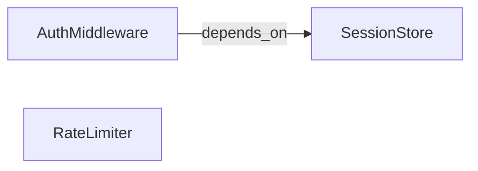

# Step 2 · Graphs in Plain Terms

## Hook

A new engineer joins a team and asks the obvious onboarding question: "how does login actually work here?" Someone answers in a sentence: "the auth middleware depends on the session store." That sentence is useful, but it's also slippery — depends on *how*? Does it read from the session store, write to it, or both? Would the auth middleware still function if the session store were swapped for a different implementation, or would it break immediately? A sentence like that can mean three or four different specific relationships, and everyone in the room is free to imagine whichever one they already had in mind. A graph exists to stop that sentence from being slippery.

## Explanation

Strip a graph down to its two working parts and there isn't much to it: a **[node](../02-foundations/glossary.md#node)** stands for one thing worth tracking — maybe a running piece of software, maybe a person, maybe something that happened. Nothing about a node by itself carries much information: write "AuthMiddleware" alone on a page and a reader learns little beyond the fact that something by that name exists somewhere. A node only starts pulling its weight once it gets tied to at least one other node.

That something is an **[edge](../02-foundations/glossary.md#edge)** — a connection between exactly two nodes that is both **directed** and **labeled**. Directed means the edge points one way, from a specific starting node to a specific ending node, not just "these two are related." Labeled means the edge names, in a word or short phrase, exactly what kind of connection this is — not "related to," which could mean anything, but something specific enough that you could imagine checking whether it's true.

Put those two properties together and a **[directed edge](../02-foundations/glossary.md#edge)** stops being a loose mention and starts being a small, falsifiable claim. `AuthMiddleware --depends_on--> SessionStore` is not the same statement as "auth middleware and the session store are related." It says, specifically: AuthMiddleware needs SessionStore to function, and the dependency runs in that direction, not the other way. You could go check the code and find out that claim is wrong — maybe the middleware only reads a cached token and never actually touches the session store at request time — and if you found that, you'd know exactly which single sentence to fix. A vague mention in a paragraph doesn't give you that; a paragraph just gets rewritten, and nobody's sure which part of the old meaning got lost.

Direction is doing real work here, not just decoration. `AuthMiddleware --depends_on--> SessionStore` and a hypothetical `SessionStore --depends_on--> AuthMiddleware` are two different claims about two different systems — one says the middleware would break without the store, the other says the store would break without the middleware, and a real codebase is very rarely symmetric that way. Losing the direction on an edge loses exactly the information that made the edge worth writing down over the vague sentence in the first place.

One more thing an edge does that a sentence doesn't: it makes silence meaningful. If a graph has a `RateLimiter` node sitting near `AuthMiddleware` with no edge between them at all, that absence is itself informative — nobody has yet asserted any relationship between the two. Compare that to a paragraph of prose, where two things being mentioned near each other often gets misread as "these are connected" even when the author never meant to claim that. A graph forces every relationship to be added on purpose; nothing connects by proximity alone.

## Diagram



Three nodes, one directed edge. `RateLimiter` sits in the same graph — it's part of the same service — but no edge connects it to anything yet, because nobody has asserted a specific relationship for it. That's a legitimate state for a graph to be in, and a different state from "this graph is wrong." See `labs/step-2-label-the-arrow.py` for this exact structure built as a plain adjacency dictionary, with a check that the two directions of the edge are never treated as the same claim.

## Claude Code vs OpenCode

Both tools can turn a plain sentence like the hook's into a structured edge — the point is the schema they're both filling in, not the tool doing the filling.

### Claude Code

A minimal extraction skill, scoped to producing exactly one directed edge per invocation:

```markdown
---
name: sentence-to-edge
description: Turns one sentence describing a relationship into a directed, labeled edge.
---

Given one sentence describing a relationship between two things, output a
single JSON object with three fields: `from` (the node the edge starts at),
`label` (a specific verb phrase for the relationship, not a vague word like
"related"), and `to` (the node the edge points to). Do not output a second
edge unless the sentence clearly describes more than one relationship.
```

Feeding it "the auth middleware depends on the session store" should produce:

```json
{ "from": "AuthMiddleware", "label": "depends_on", "to": "SessionStore" }
```

### OpenCode

The same contract, expressed as a custom command:

```markdown
---
description: Extract one directed, labeled edge from a sentence
---

Read the sentence provided as input. Identify the two things it relates and
the direction the relationship runs. Respond with JSON: {"from": ..., "label":
..., "to": ...}. The label must be specific enough that someone could check
whether it's true — reject vague labels like "related_to" or "connected_to"
and pick a verb that names the actual relationship instead.
```

Both prompts refuse the same shortcut on purpose: a label like "related_to" would technically satisfy "output a label," but it throws away exactly the specificity that makes an edge worth having over a sentence.

## Going Deeper

Notice that this page never claimed a graph needs to be large, drawn with fancy tooling, or stored in a database to count as a graph. Three nodes and one edge, written by hand in a JSON file, is a complete, valid graph — small, but not incomplete. Size is a separate question from correctness. A ten-thousand-node graph built from vague, unlabeled edges is worse than the three-node example above, because at least the three-node example is honest about exactly what it does and doesn't claim.

## Check Yourself

<details>
<summary>A teammate adds `SessionStore --depends_on--> AuthMiddleware` to the graph above, alongside the existing `AuthMiddleware --depends_on--> SessionStore`. Does the graph now just say the two are mutually dependent, in a slightly redundant way? Reveal the answer.</summary>

No — those are two separate, independently falsifiable claims, not one claim stated twice. The graph would now assert both that AuthMiddleware needs SessionStore *and* that SessionStore needs AuthMiddleware, which is a much stronger and much less common situation in a real codebase than either claim alone. If only one direction is actually true, adding the reverse edge doesn't restate the fact — it adds a second, likely false one that now has to be checked and removed on its own.

</details>

## Try With AI

Pick one real dependency from a codebase you know — pick something you could actually verify by reading the code, not something you're guessing at. Write it down first as a loose sentence, the way you'd say it out loud to a teammate. Then open Claude Code or OpenCode and ask it to turn that sentence into a `{from, label, to}` edge using a prompt shaped like the ones above. Check the label it picked: would you know how to falsify it? If the label it chose is something vague, tighten the prompt until it isn't, and notice how much more specific the resulting edge gets.

## When It Goes Wrong

**Symptom:** a graph "looks" connected when you draw it, but a query for a specific relationship comes back empty even though you were sure that relationship was in there.

**Cause:** the edge either has the wrong direction, or its label is too vague to match what the query was actually asking for — "related_to" doesn't answer "what does X depend on," even though a human skimming the diagram would have read the connection as obviously relevant.

**Fix:** treat every edge label like a claim you'd have to defend under questioning, never as a decoration. When you can't picture the piece of evidence that would prove a label wrong, that's the sign to sharpen it into something specific enough to check.

---

Up next, this Part's last page draws the line between two different kinds of graph you can build out of nodes and edges like these.
