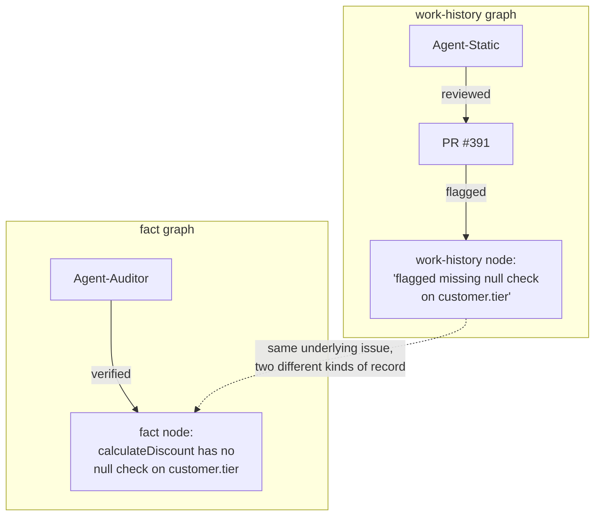

# Step 3 · Keep Your Two Graphs Separate

## Hook

PR #391 changes a pricing function called `calculateDiscount`. `Agent-Static`, a static-analysis reviewer, scans the diff and flags something: `calculateDiscount` reads `customer.tier` without checking whether `customer` itself is null first. That flag gets logged: *Agent-Static reviewed PR #391 and flagged a missing null check.* Later, a second agent, `Agent-Auditor`, is asked to independently confirm defects before they're allowed to block a merge. It reads the actual merged code, traces every call site, and confirms: yes, `calculateDiscount` really does have no null check on `customer.tier` — this isn't a false positive, it's real. That confirmation gets logged too: *`calculateDiscount` has no null check on `customer.tier`.* Two log entries, describing what looks like the same fact. A team building one graph out of this review might reasonably store them as a single node. That single node is the mistake this Step exists to head off.

## Explanation

Those two entries are not the same kind of record, even though they're about the same underlying issue. *Agent-Static reviewed PR #391 and flagged a missing null check* belongs to a **work-history graph**: a record of what was attempted, by whom, when, and with what outcome. Its job is to answer "what happened, and in what order" — if someone later asks why the merge was blocked, the work-history graph can answer "Agent-Static's pass on PR #391 raised it," which is exactly the kind of accountability trail a review process needs to stay auditable.

*`calculateDiscount` has no null check on `customer.tier`* belongs to a different graph: the **fact graph** — the record of claims about the codebase itself that the team has actually checked and is willing to build on. Its job is answering a different question: "is this true, right now, about the code" — not "who said so" or "when." Agent-Auditor's confirmation is what earns this claim a place in the fact graph at all; a flag that nobody had independently confirmed shouldn't sit in the same graph as a confirmed one, because the whole value of the fact graph is that everything in it has cleared that bar.

Here's what collapsing them into one node actually costs you, concretely. Suppose the team merges the two entries into `Agent-Static reviewed PR #391 and found calculateDiscount has no null check`. Now imagine `Agent-Static` produces a false positive on some *other* function next month — same static-analysis tool, same phrasing, no independent confirmation this time. In a merged graph, that unconfirmed flag looks structurally identical to the `calculateDiscount` entry, which *was* confirmed. A later agent querying "what are the known real issues in this codebase" has no field left to filter on — the confirmation step got flattened into the same sentence as the claim, instead of staying attached as a separate, checkable property. That's the "too noisy to trust" half of the cost: every unverified flag now reads exactly as authoritative as every verified one.

The other half runs the opposite direction. Suppose, months later, someone wants to answer "how did we first learn about the null-check bug in `calculateDiscount`, and who confirmed it?" If the merge only kept the confirmed-fact phrasing and dropped the work-history framing to save space — a common instinct once two entries look this redundant — that question no longer has an answer sitting in the graph. The order of events, which agent raised it first, and which agent independently checked it are exactly the kind of detail a work-history graph exists to preserve, and exactly the kind of detail that a fact-focused merge tends to discard as noise. That's "too sparse to reconstruct": the trail that used to answer "how did we get here" is gone.

Keeping the two graphs apart costs almost nothing extra to write — it's still one flag from Agent-Static and one confirmation from Agent-Auditor, just filed under two different node types instead of squeezed into one. What it buys back is the ability to ask either question cleanly later: query the fact graph for what's actually true about the code today, query the work-history graph for how the team found out and who checked it.

## Diagram



The dotted edge is the only thing tying the two graphs together — it says "these are about the same real issue," not "these are the same node." Everything else stays where it belongs: attempts and outcomes in the work-history graph, checked claims about the code in the fact graph.

## Claude Code vs OpenCode

Both snippets write to two separate append-only stores instead of one, which is the entire mechanism this Step is teaching.

### Claude Code

```markdown
---
name: review-graph-writer
description: Writes review findings to the correct graph -- work-history or facts, never both in one node.
---

1. If this entry is an agent's action or finding (who did what, when), append
   it to `work-history.jsonl` with fields: agent, event, pr, claim.
2. If this entry is an independently confirmed claim about the code itself,
   append it to `facts.jsonl` with fields: subject, claim, verified_by.
3. Never write the same entry to both files. If an entry has both an event
   and a confirmed claim, write two linked entries -- one per file -- not one
   merged entry.
```

### OpenCode

```markdown
---
description: Route a review entry to work-history.jsonl or facts.jsonl, never one merged file
---

Classify the incoming entry: is it a record of what an agent did (an event),
or a confirmed claim about the code (a fact)? Events go to
work-history.jsonl. Confirmed facts go to facts.jsonl. If an entry contains
both, split it into two entries and write one to each file, connected by a
shared PR or issue identifier -- do not collapse them into a single record
in either file.
```

## Going Deeper

Nothing about "verified by Agent-Auditor" makes a fact permanent. A fact graph holds the team's *current best-checked understanding*, not eternal truth — if `calculateDiscount` gets patched next sprint, the fact node needs to be marked superseded, not silently deleted, so a later reader can see both what used to be true and when that changed. Part 3 of this course covers exactly that lifecycle. For now, the point to hold onto is narrower: a confirmed claim and the event that produced it are always at least two nodes, never one.

## Check Yourself

<details>
<summary>A teammate proposes a shortcut: store only the fact graph, and skip the work-history graph entirely, since "the fact graph has the actually-true stuff anyway." What breaks? Reveal the answer.</summary>

You lose the ability to answer "how did we find out, and who checked it" for anything already in the fact graph, and — worse — you lose every unconfirmed flag entirely, since flags that never got independently verified have nowhere to live if the work-history graph doesn't exist. That means the next agent working a similar issue can't see what's already been raised and is still pending confirmation; it will re-flag the same things from scratch, with no memory that someone already looked at them once.

</details>

## Try With AI

Set up a throwaway repo with two empty files in it: `work-history.jsonl` and `facts.jsonl`. Ask Claude Code or OpenCode to act as a reviewer on some real function in a small project you have locally: have it (1) note, in `work-history.jsonl`, that it reviewed the function and what it found, and separately (2) only after re-reading the actual code to confirm the finding, write the confirmed claim to `facts.jsonl`. Open both files afterward and check: does either file contain a sentence that really belongs in the other? If the agent wrote the same sentence to both, ask it why, and have it rewrite each entry so the two files are answering different questions.

## When It Goes Wrong

**Symptom:** a query for "what's actually broken right now" returns things that turned out to be false positives nobody ever confirmed, mixed in with real, verified issues, and there's no field to filter one from the other.

**Cause:** work-history events and fact-graph claims got written to the same node at some point, usually because the two entries looked redundant enough that merging them felt like an obvious cleanup.

**Fix:** split the merged node back into its two parts — an event with an agent and a timestamp, and a claim with a verifier — and connect them with an edge instead of collapsing them into one. Going forward, write review findings the way `labs/step-3-split-the-graphs.py` demonstrates: two lists, never flattened into one.

---

Back to [Part 1 overview](README.md) · On to [Part 2 — The DAG of Work](../04-part-2-the-dag-of-work/)
