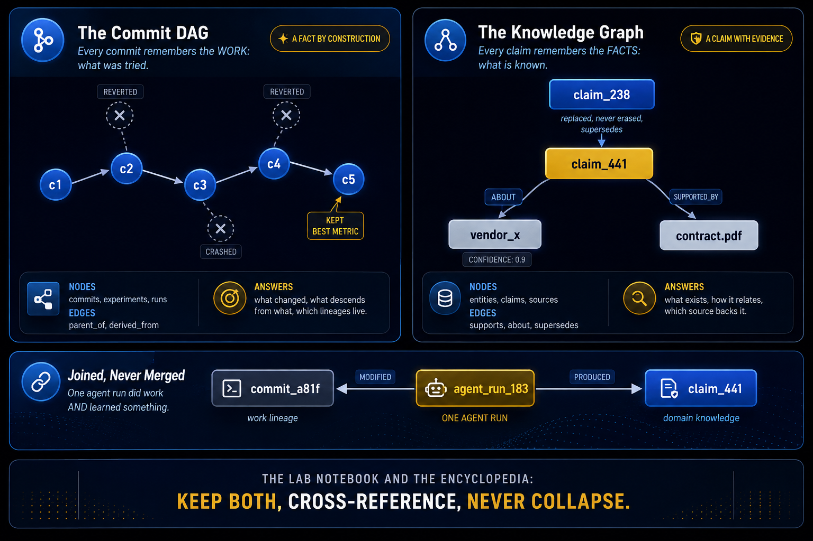

# Part 2 — The DAG of Work



---

Recording progress without losing the trail of failed attempts. This part introduces the ratchet pattern and queryable failed branches.

## What You'll Learn

Build a work-history graph that preserves learning:

- How to keep improvements without erasing failures
- Why failed attempts must stay findable
- The ratchet pattern for append-only progress

## Contents

1. **[Step 4](04-recording-attempts-without-losing-the-trail.md)** — The ratchet: keep only improvements, log everything else
2. **[Step 5](05-letting-failed-branches-stay-queryable.md)** — Make failed attempts findable

## Diagram

```mermaid
flowchart TB
    PREV["Part 1:<br/>Memory Problem"]
    
    S4["Step 4<br/>The Ratchet"]
    S5["Step 5<br/>Queryable failures"]
    
    PREV --> S4 --> S5
    
    S5 --> NEXT["Part 3:<br/>Graph of Facts"]
    
    style PREV fill:#E2E8F0,color:#000000
    style S4 fill:#4169E1,color:#FFFFFF
    style S5 fill:#4169E1,color:#FFFFFF
    style NEXT fill:#D4AF37,color:#000000
```text

## Learning Thread

**Prerequisites**: Complete Part 1. You should understand the two-graph split and why work-history needs its own structure.

**What this unlocks**: Build work-history graphs where future agents learn from past failures instead of repeating them.

## Practice

- [Quiz](quiz.md) — Test understanding
- [Flashcards](flashcards.md) — Review concepts

## Check Your Understanding

Can you:

- ✓ Explain why overwriting state loses valuable information
- ✓ Implement the ratchet pattern for append-only progress
- ✓ Make failed branches queryable by future workers
- ✓ Distinguish durable history from discarded attempts

**Ready?** Continue to [Part 3 - The Graph of Facts](../05-part-3-the-graph-of-facts/)
