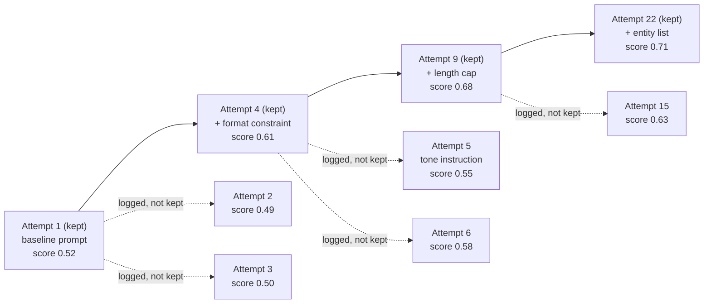

# Step 4 · The Ratchet — Recording Progress Without Losing the Trail

## Hook

A team points an overnight loop at a narrow job: find a better system prompt for a support-ticket summarizer. Each cycle it drafts one candidate prompt, runs it against a held-out set of forty tickets with human-written reference summaries, and scores the output against those references. By the time anyone checks in the next morning, the loop has tried thirty-one candidates. The engineer opens the log expecting a research trail and instead finds a single line: `current prompt: variant-31, score: 0.71`. Every other candidate — including the twenty-two that scored worse than whatever was already in place, and the one that crashed the scorer entirely — left no trace. That evening a second loop starts from the same starting prompt, wanders back into the exact same "add a one-sentence tone instruction" idea variant-9 already tried and lost with, and burns forty minutes rediscovering something the first loop already knew didn't work.

## Explanation

The overnight loop's mistake wasn't scoring badly — thirty-one attempts to climb from a mediocre prompt to a 0.71 score is a completely reasonable way to spend a night. The mistake was in what it kept. Overwriting `current prompt` on every cycle is the thin-memory trick from Step 1 wearing a new outfit: one file, rewritten in place, so the moment a better candidate lands, every trace of what came before it is gone — including the losers, which is exactly the information a later run needed.

The opposite mistake is just as real, though: log every one of the thirty-one attempts in full, unfiltered, and the record grows into something nobody can read. A future loop — or a future engineer — opening that log doesn't want thirty-one entries of roughly equal weight; it wants to know two things fast: what's the current best, and what's already been ruled out. A flat, undifferentiated log answers neither question quickly, because finding "the current best" means scanning to the end, and finding "what's been ruled out" means reading everything.

A **[ratchet](../02-foundations/glossary.md#ratchet)** splits the difference by giving the record a shape. Each new attempt gets compared against the current best kept attempt, using whatever score the task already produces. If the new attempt strictly beats it, that attempt becomes the new best — it gets appended to a chain of kept attempts, called **[durable history](../02-foundations/glossary.md#durable-history)**, that only ever grows in the direction of improvement. If the new attempt doesn't beat the current best, it isn't deleted — it gets logged as a side entry attached to whatever it lost to, but it doesn't become the new reference point for the next comparison. The name comes from the everyday tool: a ratchet wrench turns one way and refuses to slip backward, so however many times you crank it, the socket never quietly loses ground.

The payoff shows up in exactly the situation from the Hook. Durable history stays short — for thirty-one attempts, maybe four or five actually improved on the one before it, so that's the whole chain a later reader needs to skim to see how the current best prompt was reached. But nothing about a losing attempt vanished either; it's still sitting in the graph, attached to the node it lost to, with its own score and its own reasoning recorded. A second loop starting cold doesn't have to read all thirty-one entries to avoid repeating variant-9's mistake — it can check the log attached to whichever kept attempt variant-9 was compared against and see, in an instant, that the tone-instruction idea was already tried and scored worse.

## Diagram



The solid chain across the top is durable history — four attempts, each one strictly better than the last, which is all a reader needs to trace how the loop reached 0.71. The dotted branches are the logged-but-not-kept attempts, filed against whichever kept attempt they were measured against and lost to. Attempt 5's "tone instruction" idea is right there, attached to Attempt 4, for the second loop from the Hook to have found before it wasted forty minutes.

## Claude Code vs OpenCode

Both snippets implement the same comparison rule: read the current best, compare, then either extend the chain or log a side entry — never overwrite the chain with a non-improving attempt.

### Claude Code

```markdown
---
name: prompt-search-ratchet
description: Scores a candidate prompt and ratchets durable history forward only on strict improvement.
---

1. Read the current best entry from `durable-history.jsonl` (the last line;
   empty file means no baseline yet).
2. Score the candidate prompt against the held-out ticket set.
3. If the candidate's score is strictly greater than the current best's
   score (or there is no current best yet), append the candidate as a new
   line in `durable-history.jsonl`.
4. Otherwise, append the candidate to `discarded.jsonl`, including which
   entry in `durable-history.jsonl` it was compared against and why it
   lost -- never touch `durable-history.jsonl` in this branch.
```

### OpenCode

```markdown
---
description: Ratchet a candidate prompt into durable-history.jsonl only if it strictly beats the current best
---

Read the last line of durable-history.jsonl as the current best (or treat
an empty file as no baseline). Score the candidate against the held-out
ticket set. Strictly greater than the current best: append it to
durable-history.jsonl. Anything else -- tie or worse -- gets appended to
discarded.jsonl instead, tagged with the id of the entry it lost to.
durable-history.jsonl only ever grows toward better scores; it is never
rewritten in place.
```

## Going Deeper

A ratchet needs one more rule to be trustworthy: what counts as "strictly greater." A scoring function that's the least bit noisy — re-running the same prompt twice and getting 0.61 one time, 0.615 the next — will eventually let a lucky roll of an unchanged prompt "improve" the chain for no real reason, which quietly breaks the promise that durable history only records genuine progress. The fix isn't a bigger tolerance band bolted onto the comparison; it's picking (or building) a scoring function stable enough that "strictly greater" is a claim worth making in the first place. That's a property of the eval, not of the ratchet — the ratchet just enforces whatever the eval tells it, faithfully.

## Check Yourself

<details>
<summary>A teammate suggests simplifying the ratchet: instead of logging non-improving attempts to a side file, just delete them once you know they lost. Durable history would look exactly the same either way. What's lost by deleting instead of logging? Reveal the answer.</summary>

Durable history does look identical either way — that's exactly the trap. What's lost is everything the Hook depended on: the ability for a later loop, or a later engineer, to check whether some specific idea (like a tone instruction) was already tried and already scored worse. Deleting a losing attempt doesn't just shrink the log; it erases the one piece of information a fresh run most needs before it repeats the same dead end.

</details>

## Try With AI

Open a throwaway repo and create an empty `durable-history.jsonl` and an empty `discarded.jsonl`. Pick any small, scorable task you can judge quickly by eye (three-sentence summaries of the same short paragraph, rated 1-5 for how well they capture the point, works fine). Ask Claude Code or OpenCode to generate five candidate outputs one at a time, scoring each yourself and telling the agent the score, and have it apply the ratchet rule: append to `durable-history.jsonl` only if the score strictly beats the current best there, otherwise append to `discarded.jsonl` with a note on what it lost to. When all five are scored, open both files and check: is `durable-history.jsonl` shorter than five lines, and does `discarded.jsonl` still have every non-improving attempt in it, not silently missing any?

## When It Goes Wrong

**Symptom:** a loop re-tries an idea that a previous run already tried and already scored worse on, wasting a full cycle rediscovering the same dead end.

**Cause:** the previous run's non-improving attempts were either overwritten (thin-memory style) or deleted outright once they lost, so nothing in the graph could tell the new run "this was already tried."

**Fix:** keep the ratchet's two outputs as two separate, permanent records — durable history for the chain of genuine improvements, and a discard log for everything that was tried and measured but didn't make the cut. Querying that discard log before starting a new search is cheap; re-running a whole failed idea from scratch is not. `labs/step-4-the-ratchet.py` runs this exact comparison over a fixed set of candidate scores and prints both lists side by side.

---

The chain gets shorter to read, but the attempts that fell off it are still sitting somewhere in the graph. The final page of this Part asks what a later worker is actually allowed to do with them.
