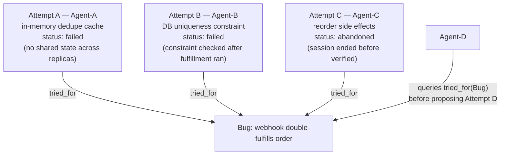

# Step 5 · Letting Failed Branches Stay Queryable

## Hook

A webhook handler is occasionally fulfilling the same order twice — Stripe fires a `payment_confirmed` event, the handler processes it, and then a retried delivery of that same event slips through and fulfills the order a second time. Three agents take a run at it over the course of a day, one after another as sessions hand off. `Agent-A` adds an in-memory cache keyed by event ID to skip duplicates — it fails, because the handler runs across several load-balanced replicas and an in-memory cache on one replica means nothing to the others. `Agent-B` adds a database uniqueness constraint on the event ID column — it fails too, but for a completely different reason: the constraint check happens after the fulfillment side effects already ran, so the duplicate row gets rejected while the order still ships twice. `Agent-C` starts reordering the side effects to run after the constraint check, but the session ends before the fix is tested, so it's neither confirmed nor ruled out — just abandoned mid-attempt. When `Agent-D` picks up the ticket that evening, the only question that matters is: what's already been tried, and why didn't it work? If the answer to that question lives nowhere, `Agent-D` starts from zero on a bug three sessions have already partially mapped out.

## Explanation

It's tempting to think of a failed attempt as something the graph should clean up once it's done being useful — the fix didn't work, the branch is dead, so why keep it around taking up space? That instinct treats "failed" as a reason to remove a node, when it's actually a reason to make sure that node stays easy to find. A **[queryable failed branch](../02-foundations/glossary.md#queryable-failed-branch)** is exactly that: an attempt that didn't resolve the bug, kept as a node in the graph with its outcome and its reasoning attached, so a later worker can ask "what's already been tried for this bug" and get a real answer instead of silence.

The word doing the real work here is *queryable*, not just *kept*. A failed attempt scribbled into a commit message or buried in a chat transcript technically still "exists" somewhere, but nothing about that makes it findable by a worker who doesn't already know to go looking for it. A queryable failed branch is a node connected to the bug it was an attempt at, through an edge that says as much — `tried_for`, in this Step's scenario — so that asking the graph "what's connected to this bug by a `tried_for` edge" returns every attempt, successful or not, without anyone needing to remember where each one was written down.

This is also where the discard log from Step 4 earns its keep beyond just prompt search. The same shape — an attempt, an outcome, a reason it didn't advance the record — applies just as well to `Agent-A`'s in-memory cache and `Agent-B`'s misplaced constraint check as it does to a losing prompt variant. Neither Step 4's ratchet nor this Step is really about prompts or bug fixes specifically; both are the same underlying move: don't let "this one didn't work" default to "this one disappears."

Notice, too, that `Agent-C`'s attempt isn't quite the same shape as `Agent-A`'s or `Agent-B`'s — it wasn't disproven, it was interrupted. A graph that only has room for "succeeded" or "failed" would force `Agent-C`'s node into one of those two boxes, and either choice loses information: marking it "failed" claims something was tested that wasn't, and dropping it entirely loses the reordering idea altogether. The honest answer is a third status — abandoned, unresolved, whatever the graph's schema calls it — and keeping that status queryable is what lets `Agent-D` see the difference between "this idea was tried and disproven" and "this idea was in progress and worth finishing" before deciding where to spend the next hour.

## Diagram



`Agent-D` doesn't need to know any of this history in advance — it queries the `tried_for` edges on the bug node and gets all three attempts back, statuses included, in one step. Nothing about querying that edge filters out the failed or abandoned ones; if it did, `Agent-D` would be right back to starting cold.

## Claude Code vs OpenCode

Both snippets query every `tried_for` edge on a bug before letting an agent propose a new fix — filtering that query down to only successful attempts would defeat the entire point.

### Claude Code

```markdown
---
name: bug-fix-history-check
description: Queries every prior fix attempt for a bug, failed and abandoned included, before proposing a new one.
---

1. Given a bug node ID, find every edge labeled `tried_for` pointing at it,
   regardless of the status on the attempt node at the other end.
2. Summarize each attempt found: who tried it, what the approach was, its
   status, and (if failed or abandoned) the reason recorded on that node.
3. Only after reviewing that full list, propose a new fix approach --
   and if the new approach resembles a failed attempt closely, say so
   explicitly instead of proposing it anyway.
```

### OpenCode

```markdown
---
description: Fetch all tried_for attempts on a bug node, statuses included, before drafting a new fix
---

Find every attempt node connected to the given bug ID by a tried_for edge.
Do not filter by status -- failed and abandoned attempts must appear in the
result alongside any successful one. List each attempt's approach, status,
and recorded reason. Only draft a new fix proposal after that full list has
been reviewed, and flag it if the new proposal overlaps with something
already marked failed.
```

## Going Deeper

Keeping failed branches queryable doesn't mean keeping them equally visible forever. A bug that's been open for months can accumulate a long list of failed attempts, and a worker querying `tried_for` still needs to read that list quickly, the same problem Step 4 solved for prompt search. The fix is the same shape too: nothing here says a failed-branch query has to return every attempt with equal weight — it can be sorted by recency, grouped by which underlying cause each attempt was chasing, or summarized before a worker reads the full detail. What has to stay true, no matter how the query result gets shaped for readability, is that a failed or abandoned attempt is always in the underlying result set, never silently dropped from it.

## Check Yourself

<details>
<summary>Someone proposes closing the loop faster: once a fix attempt fails, delete its node immediately instead of leaving it there for a query to find later. Storage stays smaller, and nothing about the bug's current status changes. What actually breaks? Reveal the answer.</summary>

The bug's current status doesn't change, which is exactly why this feels safe -- but the next agent's starting point changes completely. Without Attempt A and Attempt B's nodes, Agent-D has no way to learn that an in-memory cache and a misplaced constraint check were already tried and already failed, for specific, recorded reasons. It's free to re-propose either one from scratch, and nothing in the graph will stop it or even warn it, because the evidence that would have stopped it was deleted the moment it stopped being a "current" fix.

</details>

## Try With AI

Create a throwaway repo with one plain-text file in it, `bug-attempts.jsonl`, seeded with two JSON lines representing failed fix attempts for some bug you invent (each with an approach and a reason it failed). Have Claude Code or OpenCode step into the role of a new agent picking up that bug: first, get it to read `bug-attempts.jsonl` in full and summarize what's already been tried, then have it propose a third approach. Check the proposal against the two failed attempts yourself -- does it avoid re-proposing either one, or does it wander back into the same idea because it wasn't actually forced to read the file first? If it skipped straight to proposing without reading, that's the failure this Step is about, reproduced live.

## When It Goes Wrong

**Symptom:** a new agent (or a returning teammate) proposes a fix that was already tried and already failed, and nobody notices until it fails again the same way.

**Cause:** the failed attempt's node was deleted, or was never made queryable in the first place (logged somewhere a query can't reach it), so the new agent had no way to find out it had been tried before proposing it.

**Fix:** attach every fix attempt to the bug it targets with a real, queryable edge, and keep that edge in place regardless of whether the attempt succeeded, failed, or was abandoned mid-session. `labs/step-5-failed-branch-stays.py` builds this exact three-attempt scenario and asserts that querying the bug still returns both failed attempts, not just the surviving one.

---

Back to [Part 2 overview](README.md) · On to [Part 3 — The Graph of Facts](../05-part-3-the-graph-of-facts/)
