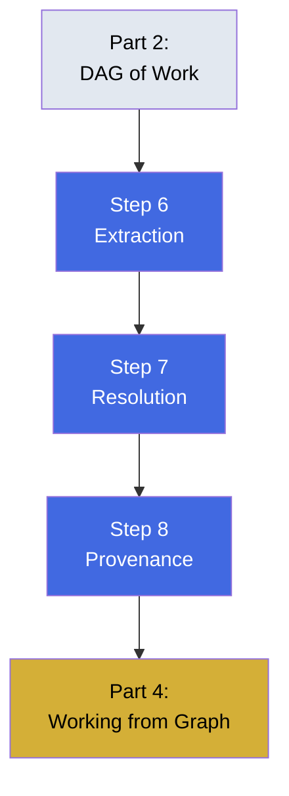

# Part 3 — The Graph of Facts

Building a fact graph from extraction to provenance. This part covers schema-first extraction, reversible merging, and tracking claim sources.

## What You'll Learn

Build a fact graph that maintains trust and traceability:
- Schema-first extraction from unstructured sources
- Merging duplicates without losing evidence
- Attaching provenance to every claim

## Contents

1. **[Step 6](step-6-extraction-schema-first-prose-second.md)** — Schema-first extraction
2. **[Step 7](step-7-resolution-merging-without-losing-the-evidence.md)** — Reversible merging
3. **[Step 8](step-8-provenance-every-claim-keeps-a-receipt.md)** — Tracking claim sources

## Diagram

## Learning Thread

**Prerequisites**: Complete Parts 1-2. You should understand the fact graph's purpose and how it differs from work-history.

**What this unlocks**: After this part, you'll know how to pull structured claims from documents, merge mentions of the same thing, and maintain a chain of custody for every fact.

## Practice

- [Quiz](quiz.md) — Test your understanding
- [Flashcards](flashcards.md) — Review key concepts

## Check Your Understanding

After completing this part, you should be able to:

- ✓ Define a schema before extraction begins
- ✓ Merge duplicate mentions reversibly
- ✓ Attach provenance records to every claim
- ✓ Explain why editing claims in place destroys history

**Ready?** Continue to [Part 4 - Working From the Graph](../06-part-4-working-from-the-graph/)
