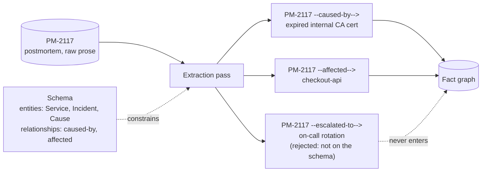

# Step 6 · Extraction — Schema First, Prose Second

## Hook

An on-call engineer files the postmortem for `PM-2117`: overnight, `checkout-api` started rejecting every request with a 500. The root cause was a certificate authority's root cert expiring, which broke mutual TLS between `checkout-api` and its database sidecar, and the outage cascaded downstream into `notifications-worker`, which depends on `checkout-api`'s queue. Someone points an agent at the postmortem and asks it to "pull out the facts." First run: *"Incident: checkout had an outage last night, the cert expired, and notifications got hit too."* Run it again five minutes later, same document, no code changed: *"PM-2117 — checkout-api down, root cause was an expiring internal CA cert, downstream impact on notifications-worker."* A teammate wires a small dashboard on top of whichever run happens to land, expecting a `caused_by` field it can chart against — and depending on which of the two runs it reads, that field is either missing entirely or spelled three different ways. Nothing about either run was wrong, exactly. Neither one was answering a question with a fixed shape, because nobody had defined one.

## Explanation

Ask a capable model to "pull out the facts" from a document and it will — competently, fluently, and differently every time, because prose has no fixed shape for an extraction to fall back on. Two runs over the same postmortem can both be reasonable summaries and still be structurally incompatible, because "reasonable summary" was never the target. The fix isn't a better prompt for summarizing; it's deciding, before any extraction runs at all, exactly what an acceptable answer is allowed to look like.

A **[schema](../02-foundations/glossary.md#schema)** is that decision made explicit: a fixed list of entity types and a fixed list of relationship types the graph is willing to hold. For `PM-2117`, a workable schema might be small on purpose — entity types `Service`, `Incident`, `Cause`, and relationship types `caused-by` (an `Incident` traces to a `Cause`) and `affected` (an `Incident` reaches a `Service`). Nothing outside that list gets in. Not because the postmortem doesn't mention other things — it mentions an on-call rotation, a Slack channel, a rollback that didn't help — but because the schema only promises to hold what it explicitly agreed to hold, and a promise like that is worthless the moment it quietly expands to fit whatever showed up in the document.

**[Extraction](../02-foundations/glossary.md#extraction)** is the pass that turns the postmortem's prose into items shaped like the schema — and, just as importantly, the pass that has somewhere to send items that don't fit. `PM-2117` --caused-by--> "expired internal CA cert" matches: an `Incident` node, a `Cause` node, a `caused-by` edge, all on the allowed list. An item like `PM-2117` --escalated-to--> "on-call rotation" doesn't match anything the schema defined — there's no `escalated-to` relationship type and no `Team` entity type — and a schema that's actually enforced rejects that item outright instead of quietly widening itself to fit it. That rejection is the whole point: a schema that accepts everything offered to it isn't a schema, it's just a suggestion, and the dashboard from the Hook breaks exactly when a field it depends on turns out to have been a suggestion the whole time.

## Diagram



Two items pass through because their entity types and relationship type are on the allowed list. The third is built from the same document and reads just as plausibly as the other two, but `escalated-to` and a `Team` entity were never defined in the schema, so it's discarded at the gate rather than admitted and reshaped to fit.

## Claude Code vs OpenCode

Both snippets do the same job: hand the model a fixed schema up front, then check every item the model returns against that schema before anything reaches the graph — nothing gets a pass for merely sounding right.

### Claude Code

```markdown
---
name: postmortem-fact-extractor
description: Extracts Service/Incident/Cause facts from a postmortem doc against a fixed schema, rejecting anything outside it.
---

1. Read the schema first: entity types are exactly `Service`, `Incident`,
   `Cause`; relationship types are exactly `caused-by` (Incident to Cause)
   and `affected` (Incident to Service). Do not add a type because the
   document seems to call for one.
2. Read the postmortem and produce a list of `{subject_type, subject,
   relation, object_type, object}` items describing what it states.
3. Check every item against the schema from step 1. Keep only items whose
   subject_type, relation, and object_type all appear on the allowed
   lists. Report every dropped item and which part of it failed the check.
```

### OpenCode

```markdown
---
description: Extract Service/Incident/Cause facts from a postmortem against a fixed schema; drop anything the schema doesn't define
---

Entity types allowed: Service, Incident, Cause. Relationship types
allowed: caused-by (Incident -> Cause), affected (Incident -> Service).
Read the postmortem and list candidate {subject_type, subject, relation,
object_type, object} items. Before returning anything, filter the list:
drop any item whose subject_type, relation, or object_type is not one of
the four allowed values above, and say what was dropped and why. Never
invent a fifth entity type or a third relationship type to fit something
the document mentions.
```

## Going Deeper

Schema-first extraction is also a shortcut around building a dedicated pipeline: instead of writing bespoke parsing code for every document shape a team might produce, a capable model given a fixed schema and asked for structured output can do the same job, with the schema doing the work a hand-built parser used to do. That's the idea this Step borrows — schema as contract, model as the thing that fills it in — credited in full in this course's [source material](../../resources/sources.md). It's still worth sizing the schema to the job: a three-entity, two-relationship schema like `PM-2117`'s is easy to enforce and easy to review; a fifty-type schema drifts toward being unreviewable by anyone, which defeats the reason to have one.

## Check Yourself

<details>
<summary>A teammate suggests loosening the rule: instead of rejecting an item that names a type the schema doesn't have, just add that type to the schema on the spot so nothing gets lost. What does this quietly give up? Reveal the answer.</summary>

It gives up the one thing a schema was for: a fixed, reviewed definition of what counts as an acceptable answer. If every extraction run is allowed to expand the schema to fit whatever it found, the schema stops being a contract decided in advance and becomes a running tally of whatever any document has ever mentioned — which is exactly the shapeless, inconsistent output from the Hook, just accumulated one convenient exception at a time instead of all at once.

</details>

## Try With AI

Write three or four sentences describing a small, made-up incident of your own — pick any service name and any single cause. Define a tiny schema for it: two or three entity types, one or two relationship types, written down before you touch the model. Ask Claude Code or OpenCode to extract facts from your sentences against that schema, then deliberately add one more sentence mentioning something outside the schema's types (a person's name, a ticket number, whatever you didn't define an entity type for). Check the output: did the extraction correctly leave that extra detail out, or did it invent a new type to fit it in anyway? If it invented one, tighten your prompt until it stops.

## When It Goes Wrong

**Symptom:** two extraction runs over the same document produce facts that don't line up — different field names, different granularity, one run mentioning something the other silently dropped.

**Cause:** there was no schema decided in advance, so each run was free to improvise its own shape for what counts as a fact, and "improvised independently, twice" rarely produces the same shape twice.

**Fix:** write the schema down before running extraction at all, and enforce it as a hard filter on the output, not a suggestion the model can talk its way around. `labs/step-6-schema-first-extraction.py` runs a fixed schema against a fixed set of extracted items and shows the one deliberately-malformed item getting rejected rather than smuggled in.

---

Schema settles what an item is allowed to look like. The next page covers what to do once two differently-shaped mentions turn out to name the same thing.
