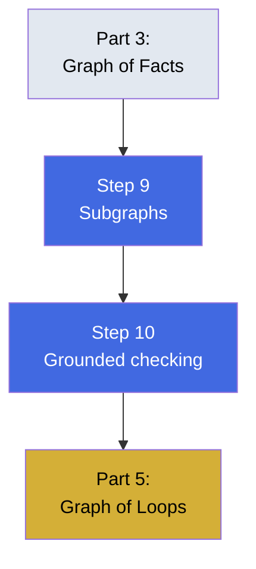

# Part 4 — Working From the Graph

Using fact graphs to inform workers and verify their outputs. This part shows how to scope subgraphs and check claims mechanically.

## What You'll Learn

Put the fact graph to work:
- Scoping task-sized subgraphs instead of dumping everything
- Verifying claims against real edges, not confidence scores
- Building grounded checkers that decompose claims

## Contents

1. **[Step 9](step-9-subgraphs-give-a-worker-a-slice-not-the-graph.md)** — Task-scoped subgraphs instead of full dumps
2. **[Step 10](step-10-the-grounded-checker.md)** — Verify claims against real edges

## Diagram

## Learning Thread

**Prerequisites**: Complete Parts 1-3. You should have a fact graph built and understand extraction, resolution, and provenance.

**What this unlocks**: After this part, you'll know how to hand workers only the graph slice they need and verify their outputs mechanically instead of trusting tone.

## Practice

- [Quiz](quiz.md) — Test your understanding
- [Flashcards](flashcards.md) — Review key concepts

## Check Your Understanding

After completing this part, you should be able to:

- ✓ Scope a subgraph to a specific task boundary
- ✓ Decompose prose claims into falsifying edges
- ✓ Build a grounded checker that queries the graph
- ✓ Explain why checking "sounds right" isn't checking

**Ready?** Continue to [Part 5 - The Graph of Loops](../07-part-5-the-graph-of-loops/)
