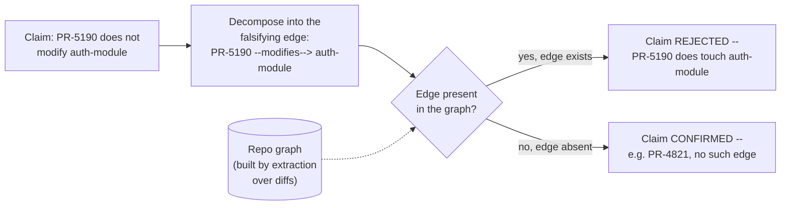

# Step 10 · The Grounded Checker

## Hook

`PR-5190` lands with a description that reads well: *"Refactors the login form's client-side validation. No backend changes, doesn't touch auth."* It's a five-hundred-line diff, mostly HTML and CSS tweaks, and the description is confident and specific in exactly the way a reviewer wants a description to sound. A reviewer bot is asked to confirm the claim before the PR merges automatically. Reading the diff top to bottom, buried on line 340 among the form markup, is a one-line change to `login_view.py` that swaps in a helper imported straight from `auth-module` — a small, easy-to-miss edit in a diff that's otherwise entirely front-end. A checker that judges the claim by how the description reads, or by skimming for anything that looks alarming, has no particular reason to catch that one line; it sounds like a UI refactor because the author believed it was one. The graph tracking this repo already has the fact that would settle the question sitting right there in it — a `modifies` edge from `PR-5190` to `auth-module`, produced the same way every other `modifies` edge was, by extraction over the diff. Nobody asked the graph.

## Explanation

A model reading a diff and a description together will form an impression, and an impression is exactly what shouldn't decide whether a PR touching authentication code merges unreviewed. The alternative isn't a smarter read — it's not reading at all, in the sense of forming a judgment from tone or plausibility. A **[grounded checker](../02-foundations/glossary.md#grounding)** verifies a claim mechanically, against the specific edges in the graph that would have to exist for the claim to be true or false, rather than asking whether the claim sounds right.

The move that makes this possible is **decomposing** the claim before checking anything. "This PR doesn't touch the auth path" isn't itself something a graph query can answer — it's prose. What a graph query *can* answer is a specific edge: does `PR-5190 --modifies--> auth-module` exist. That single edge, called a **decomposed claim** once it's been pulled out of the prose version, is the one fact whose presence or absence settles the whole question. If the edge exists in the graph, the claim is false, full stop, regardless of how the rest of the diff reads. If it doesn't exist, the claim holds. There's no partial credit and no tone to weigh — decomposition turns "does this sound like it touches auth" into "does this specific edge exist," which is a question a checker can answer without judgment entering into it anywhere.

This only works because the graph the checker is querying was built the way [the Part 3 pages](../05-part-3-the-graph-of-facts/) describe: `modifies` edges come from **[extraction](../02-foundations/glossary.md#extraction)** against a fixed **[schema](../02-foundations/glossary.md#schema)** (entity types `PR` and `Module`, relationship type `modifies`), each one carrying a provenance record naming the diff it was pulled from — not from a second model skimming the same diff and forming its own impression. A grounded checker is only as trustworthy as the edges it's checking against; ask it to verify a claim against a graph nobody extracted carefully, and it's just a slower way of arriving at the same tone-based guess it was supposed to replace. Given a graph built honestly, though, the check itself stops being a judgment call. `PR-4821`, filed the same week, touches only `rate-limiter.py` and `retry-config.py` — no `auth-module` edge exists for it anywhere in the graph — and its "doesn't touch auth" claim is confirmed the same mechanical way `PR-5190`'s is rejected: by looking for one edge, not by reading either description.

## Diagram



The checker never reads either PR's description. It decomposes the claim into one falsifying edge, asks the graph whether that edge exists, and reports whatever the graph actually says — which is why the same procedure correctly confirms `PR-4821`'s claim and rejects `PR-5190`'s, using nothing but the presence or absence of one edge each time.

## Claude Code vs OpenCode

Both configurations do the same two-step job: turn the claim into the one edge that would falsify it, then check the graph for exactly that edge — never the description, never the diff's overall tone.

### Claude Code

```markdown
---
name: grounded-pr-claim-checker
description: Verifies a PR's "doesn't touch X" claim by checking the graph for the one edge that would make it false, ignoring the PR description entirely.
---

1. Given a claim of the form "PR <id> does not modify <module>", decompose
   it into the single edge that would have to exist for the claim to be
   false: `<id> --modifies--> <module>`. Do not read the PR's description
   or commit message as evidence either way.
2. Query the repo graph for that exact edge. The graph's `modifies` edges
   come from extraction over the actual diff, so this is a lookup, not an
   inference.
3. If the edge exists, reject the claim and name the edge that falsifies
   it. If the edge is absent, confirm the claim. State which of the two
   happened and why -- never "looks fine" without naming the edge checked.
```

### OpenCode

```markdown
---
description: Ground a PR's "doesn't touch X" claim in the graph instead of the PR description -- check for the one falsifying edge, not for tone
---

Take the claim "PR <id> does not modify <module>" and decompose it into
the edge that would falsify it: <id> --modifies--> <module>. Look that
edge up directly in the repo graph -- built from extraction over the
diff, not from reading prose. If the edge is present, reject the claim
and cite the edge. If it's absent, confirm the claim. Never substitute a
read of the PR description for the graph lookup, and never report a
result without naming the specific edge the decision rested on.
```

## Going Deeper

A grounded checker trades something for its mechanical reliability: it can only ever answer questions that were anticipated by the schema doing the extraction. If a claim decomposes into an edge type nobody thought to extract — say, "doesn't touch anything user-facing," where "user-facing" was never one of the schema's relationship types — the checker has nothing to query and no honest way to answer. That's not a flaw to work around with a fallback guess; it's a signal that either the claim needs restating in terms the graph actually tracks, or the schema needs a new edge type added deliberately, the same way [Part 3's extraction step](../05-part-3-the-graph-of-facts/) treats any gap between what a document says and what a schema defines. A grounded checker that starts inventing plausible-sounding answers for edges it can't find has quietly turned back into the tone-reading checker it replaced.

## Check Yourself

<details>
<summary>Someone suggests speeding the checker up: skip the graph lookup for PRs under fifty lines, since a small diff is unlikely to sneak in an auth change, and just trust the description for those. What does this exception quietly reintroduce? Reveal the answer.</summary>

It reintroduces exactly the failure the grounded checker was built to remove, just gated by a size threshold instead of applied to everything. A single import line swapped into a fifty-line diff is precisely the kind of change "unlikely" doesn't rule out -- the whole reason line 340 of `PR-5190` mattered wasn't that the diff was large, it's that one specific edge existed. A checker that trusts descriptions below some size cutoff has decided, for every PR under that line count, to go back to judging by plausibility instead of checking the one fact that actually settles the claim.

</details>

## Try With AI

Write two short, made-up "PRs" of your own as plain text: for each, a one-line description making a "doesn't touch X" claim, and a short list of two or three files or modules it actually changes (make one PR's claim true and the other's false on purpose). Ask Claude Code or OpenCode to decompose each claim into the specific edge that would falsify it, then check that edge against your file lists rather than against the description text. Confirm it correctly rejects the false claim and confirms the true one — and check whether its stated reasoning actually names the edge it checked, or whether it slipped back into commenting on how the description reads.

## When It Goes Wrong

**Symptom:** a checker approves a claim that later turns out to be false, and the diff or evidence needed to catch it was sitting in the graph the whole time.

**Cause:** the checker judged the claim by reading a description or skimming for anything alarming, instead of decomposing the claim into a specific edge and querying the graph for it — so a fact the graph already had went unchecked.

**Fix:** always decompose a claim into the exact edge that would falsify it before answering anything, and answer strictly from whether that edge is present. `labs/step-10-grounded-checker.py` runs this decompose-then-check procedure against a small graph and asserts it correctly rejects a fabricated claim whose falsifying edge is actually present, not just claims where the answer was easy.

---

Back to [Part 4 overview](README.md) · On to [Part 5](../07-part-5-the-graph-of-loops/), where more than one loop starts reading from and writing to the same graph.
