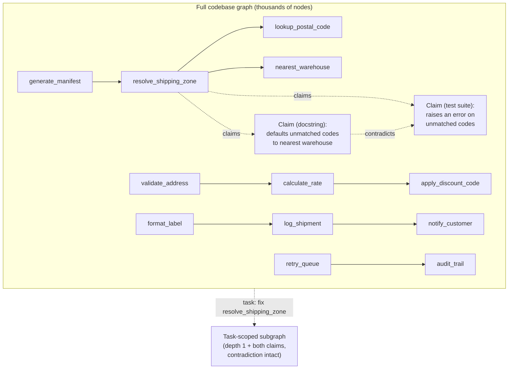

# Step 9 · Give a Worker a Slice, Not the Whole Graph

## Hook

A shipping platform's codebase has been running through extraction for months: every function is a node, every `calls` relationship between two functions is an edge, and every docstring or test assertion describing what a function is supposed to do landed as its own claim node, connected back to that function by a `claims` edge. The graph now holds a few thousand nodes. A ticket comes in: `resolve_shipping_zone`, the function that decides which warehouse fulfills an order, is occasionally routing shipments to the wrong coast. An agent picks up the ticket and, wanting to be thorough, asks for the whole graph before touching anything. What comes back is every function in the platform, chained together call after call, with `resolve_shipping_zone` buried somewhere in the middle — and, attached to that one function, two claim nodes from two different sources that flatly disagree about what it's supposed to do when a postal code doesn't match anything on file. Nobody built a way to hand this agent just the part of the graph its actual task touches, so it gets everything, and the one detail it actually needed to notice sits lost among thousands of edges that have nothing to do with the bug.

## Explanation

Nothing about having a graph requires handing the whole thing to whoever asks for it. A **[subgraph](../02-foundations/glossary.md#subgraph)** is a deliberately bounded slice of a larger graph — for a worker fixing `resolve_shipping_zone`, that means the function itself plus its direct dependencies: what it calls, what calls it, nothing two or three hops further out. Building that slice isn't a shortcut taken because the full graph is inconvenient to read; it's the whole point of having a graph rather than a document. A graph that gets handed over in full, every time, defeats its own purpose — an agent drowning in a few thousand irrelevant nodes is barely better off than one working from no structured memory at all.

The package a worker actually receives — the subgraph plus whatever framing tells it what task it's for — is its **task-scoped context**. Scoping by task, not just by proximity, matters because "everything within one hop of `resolve_shipping_zone`" and "everything this fix actually needs" aren't automatically the same set: a hop that only touches formatting or logging can usually be left out, while a claim node two hops away that directly disputes the function's behavior usually can't be. A subgraph built by depth alone is a starting point; a subgraph built for a task asks depth *and* relevance the same question.

The part that's easy to get wrong is what happens when the slice-building step runs into an actual disagreement. `resolve_shipping_zone` here has two claim nodes attached to it that contradict each other — one from a docstring, one from a test file — and it would be tempting for whatever assembles the subgraph to quietly pick the more recent one, or the one from the more trusted source, and hand the worker a clean, single answer. That's not resolution in [Part 3](../05-part-3-the-graph-of-facts/)'s sense — resolution only merges mentions that turn out to name the *same* thing, and these two claims are not the same claim wearing different words; they actually disagree about what the function does. A **contradiction-aware bundle** is a subgraph that keeps both sides of a live disagreement intact across the boundary, rather than letting the boundary-drawing step silently settle it before the worker ever sees there was anything to settle. The worker fixing the bug needs to know the graph itself is unsure what `resolve_shipping_zone` is supposed to do — that's material to the fix, not noise to be tidied away on the way out the door.

## Diagram



The right-hand slice keeps `resolve_shipping_zone`, its direct callers and callees, and both disputing claim nodes with the `contradicts` edge between them. Everything reachable only through `validate_address`, `format_label`, or `retry_queue` never crosses into the worker's context — it isn't wrong to exist, it's just not what this task needs.

## Claude Code vs OpenCode

Both configurations build the subgraph the same way: start from the target node, pull its direct neighbors, and separately pull any claim nodes attached to the target — including both sides of a disagreement — rather than collapsing them before the worker sees the slice.

### Claude Code

```markdown
---
name: task-scoped-subgraph-builder
description: Builds a depth-1 subgraph around a target function for one task, keeping any contradicting claim nodes attached to it intact.
---

1. Given a target node (the function under repair) and the full graph,
   collect every node reachable in exactly one hop via a `calls` or
   `called_by` edge. This is the target's direct dependency set.
2. Separately, collect every claim node attached to the target via a
   `claims` edge, regardless of how many claims that is or whether they
   agree with each other. Do not pick a "winning" claim and drop the
   rest — carry every one, plus any `contradicts` edge between them.
3. Return the target, its direct dependencies, and its full set of
   attached claims as one bounded subgraph. State the node count of the
   subgraph next to the node count of the full graph, so it's visible
   how much was left out.
```

### OpenCode

```markdown
---
description: Build a task-scoped subgraph around one function -- direct dependencies plus every attached claim, contradictions included
---

Given a target function node and the full graph: pull every node one
`calls`/`called_by` hop from the target, and separately pull every claim
node connected to the target by a `claims` edge, however many there are
and whether or not they agree. Never resolve a disagreement between two
claims by silently dropping one -- keep both, and keep any `contradicts`
edge linking them, inside the returned subgraph. Report the subgraph's
node count against the full graph's node count so the scope reduction is
explicit, not just assumed.
```

## Going Deeper

Depth is a knob, not a fixed rule, and it's worth being honest about the tradeoff on either side of it. A depth-0 slice — just the target node, nothing else — is easy to build and nearly useless, because a worker fixing a function almost always needs to know what calls it and what it calls. A depth-3 or depth-4 slice starts creeping back toward the whole-graph problem this Step exists to avoid, pulling in nodes several relationships removed from anything the task actually touches. Depth 1, plus an unconditional pull of any claim node attached directly to the target regardless of hop count, is a reasonable default for exactly the reason it sounds arbitrary: most single-function fixes live at that radius, and the cases that don't are usually a sign the task was scoped too narrowly in the first place, not that the subgraph builder needs a bigger number.

## Check Yourself

<details>
<summary>Someone on the team suggests an adjustment: whenever a target node carries two contradicting claims, retain only the claim whose provenance record is newer, on the grounds that "newer" is a defensible tiebreaker and it keeps the slice simpler. What does the worker lose if the subgraph builder does this? Reveal the answer.</summary>

The worker loses the information that the graph itself doesn't have a settled answer. "More recent" is a plausible tiebreaker for a human deciding which claim to believe, but silently applying it inside subgraph construction hides the disagreement entirely — the worker sees one clean claim and has no way to know a second, contradicting one exists, let alone weigh whether the older claim might actually be the correct one. Recency is a fine input to a decision; it's a poor substitute for letting the worker see there was a decision to make at all.

</details>

## Try With AI

Sketch (on paper or in a scratch file) a tiny graph of your own: four or five nodes representing pieces of a task you're familiar with — files, functions, or steps in a process — connected by a relationship you name yourself. Attach two claim nodes to one of those pieces that disagree about something concerning it (what it's for, whether it's still needed, how it should behave). Ask Claude Code or OpenCode to build a task-scoped subgraph around that one piece: direct neighbors only, plus both claims. Check the result — did it keep both disagreeing claims visible, or did it quietly resolve them into one answer on your behalf? If it resolved them, ask it why, and see whether it can explain what it dropped.

## When It Goes Wrong

**Symptom:** a worker's fix looks locally correct but breaks an assumption another part of the system was relying on, and the worker never mentions being aware of any tension around the function it changed.

**Cause:** the subgraph it was handed either didn't include a claim node that flagged the disagreement, or included both claims but let one get filtered out somewhere between graph and worker, so the worker acted on a single, falsely confident version of what the function was supposed to do.

**Fix:** build the subgraph to keep every claim attached to the target node, contradictions included, and confirm the contradiction actually survives the handoff rather than assuming it does. `labs/step-9-task-scoped-subgraph.py` builds a full graph and a task-scoped subgraph from it, and asserts the subgraph is smaller than the full graph while still carrying the deliberately-contradicting claim pair intact.

---

A slice that carries its contradictions is still just information. The next page covers what a checker does with that information once it has to decide whether a specific claim actually holds.
