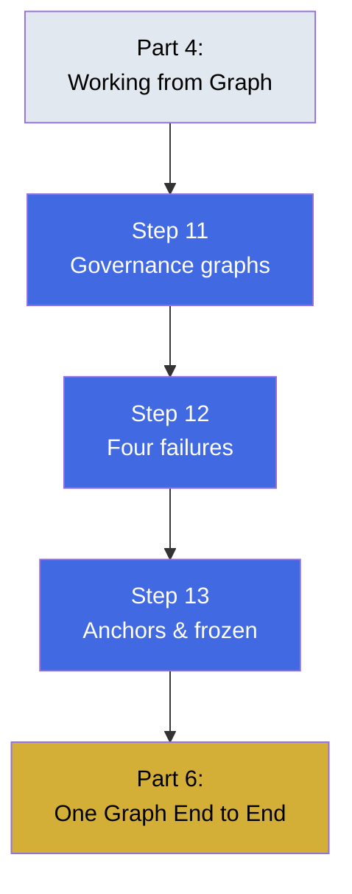

# Part 5 — The Graph of Loops

Governing multiple loops and preventing common failure patterns. This part introduces governance graphs and the four ways lone loops fail.

## What You'll Learn

Connect loops safely and prevent predictable failures:
- Building governance graphs that wire loops together
- Recognizing and fixing the four failure modes
- Using anchors and frozen nodes to prevent drift

## Contents

1. **[Step 11](step-11-wiring-loops-together.md)** — Governance graphs for multi-loop systems
2. **[Step 12](step-12-four-ways-a-lone-loop-fails-itself.md)** — Four failure modes and their fixes
3. **[Step 13](step-13-anchors-and-frozen-nodes.md)** — Preventing drift with anchors

## Diagram

## Learning Thread

**Prerequisites**: Complete Parts 1-4. You should understand both work-history and fact graphs, and how to use them.

**What this unlocks**: After this part, you'll know how to connect multiple loops safely, recognize when a lone loop is gaming metrics or drifting, and apply the right governance fix.

## Practice

- [Quiz](quiz.md) — Test your understanding
- [Flashcards](flashcards.md) — Review key concepts

## Check Your Understanding

After completing this part, you should be able to:

- ✓ Wire loops together using a governance graph
- ✓ Identify metric-gaming, blind spots, collisions, and drift
- ✓ Choose the right repair for each failure mode
- ✓ Use anchors to detect when loops seal themselves off

**Ready?** Continue to [Part 6 - One Graph End to End](../08-part-6-one-graph-end-to-end/)
