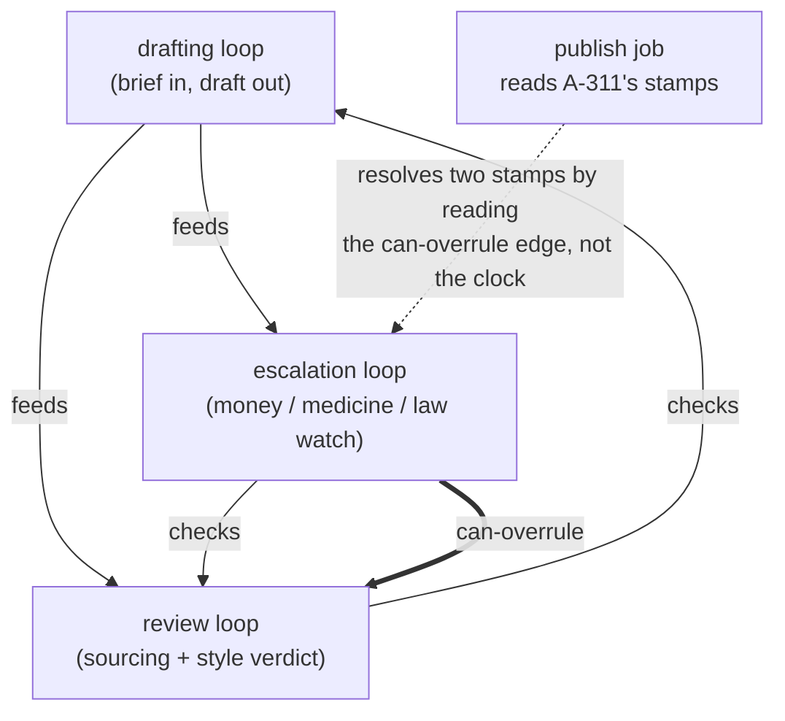

# Step 11 · Wiring Loops Together

## Hook

A publishing team runs three automated loops over one shared article graph. The drafting loop takes an assigned brief and writes a draft into the graph. The review loop reads each draft, confirms every factual sentence traces back to a claim that already carries a receipt, and stamps the article `approved` or `blocked`. The escalation loop watches for something narrower: any draft whose claims touch money, medicine, or law gets pulled aside and put in front of a named human editor before it can go anywhere.

On a Tuesday morning, article `A-311` — a short explainer about a new tax credit — comes out of drafting. The escalation loop, which only has to scan for a handful of words, stamps it `hold-for-editor` at 09:14:22. The review loop takes longer, because it traces every figure in the piece back to a sourced claim and runs the style rules, and at 09:14:41 it stamps the same article `approved`. Two verdicts now sit on one node. Both loops behaved exactly as designed. The publish job that reads the node next finds two stamps, has no rule for choosing between them, and takes the fresher one — so an unreviewed piece of tax guidance goes live, and would not have if the review loop had happened to finish a few seconds quicker.

## Explanation

The bug here is not in any of the three loops. Each one is correct in isolation, and no amount of sharpening any single one of them fixes anything, because the missing piece was never inside a loop to begin with. What the system was missing is a written-down statement of how the loops stand in relation to one another — and that statement is exactly the sort of thing a graph is for.

So build one. Make each loop a node. Make each relationship between two loops an edge with a label that says something specific and checkable. What you get is a **[governance graph](../02-foundations/glossary.md#governance-graph)**: a second, much smaller graph whose subject matter is the loops themselves, sitting on top of the article graph they all read from and write to.

Three edge labels carry most of the weight, and it matters that they are three labels rather than one vague "related to." A `feeds` edge says one loop's output is the next one's input — `drafting feeds review` tells you the order events happen in and what stalls if the upstream loop goes quiet. A `checks` edge says one loop passes judgment on another's output: `review checks drafting` records that a draft is not finished merely because drafting emitted it. Neither of those labels, though, answers the question the publish job actually had. That question needs a third label carrying authority — `escalation can-overrule review` — and once that edge exists in the graph, a node with two conflicting stamps stops being ambiguous. It becomes a lookup: find the two loops that issued the verdicts, ask the governance graph whether either outranks the other, and obey the winner. The publish job never has to guess, and it never has to consult a timestamp.

One structural rule keeps this honest: the `can-overrule` edges have to point in one consistent direction overall. If somebody later adds `review can-overrule escalation` — perhaps because review has the fuller view of the article's sourcing — the authority edges form a ring, and asking the graph who wins returns you to where you started. Authority that cycles is not authority. The `feeds` and `checks` edges may loop back on each other freely; the overrule edges may not, and a governance graph is worth checking for exactly that property before anyone relies on it.

## Diagram



Only the doubled arrow settles anything. Strip it out and the picture still shows three sensible loops passing work between them, which is precisely the state `A-311` was published from — the diagram would look fine and the system would still have no answer for a node wearing two stamps at once.

## Claude Code vs OpenCode

Both configurations resolve the same standoff the same way: when one article carries verdicts from two different loops, they consult the recorded authority relationship between those loops rather than reconciling by recency or by rereading the article.

### Claude Code

```markdown
---
name: publish-gate
description: Decides whether an article ships when two loops have stamped it differently, by reading the governance graph's can-overrule edges instead of the timestamps.
---

1. Collect every verdict stamped on the article node, along with which
   loop issued each one. Do not sort them by time and do not treat the
   most recent stamp as authoritative.
2. For each pair of disagreeing verdicts, look for a `can-overrule` edge
   between the two issuing loops in the governance graph. Obey the
   verdict from the loop the edge points away from.
3. If no `can-overrule` edge connects the pair, stop and report an
   unresolvable conflict naming both loops. Do not publish, and do not
   invent a tiebreak -- a missing authority edge is a gap in the
   governance graph, and the fix is to add the edge deliberately.
4. Before trusting any answer, confirm the `can-overrule` edges contain
   no cycle. A ring of authority means the graph cannot rank anyone.
```

### OpenCode

```markdown
---
description: Ship-or-hold decision driven by recorded loop authority, never by which stamp landed last
---

Gather all stamps on the article and the loop behind each. Where two
stamps disagree, query the governance graph for an authority edge
joining those two loops and follow whichever loop outranks the other.
No such edge means no decision: report both loops and the conflict,
leave the article unpublished, and flag the missing edge as something a
human needs to add on purpose. Reject the whole graph as unusable if its
authority edges form a ring -- a cyclic ranking cannot resolve anything.
Recency is never a tiebreak here.
```

## Going Deeper

It is tempting, once the governance graph exists, to fill it in completely — every loop related to every other loop, authority ranked top to bottom before anything has gone wrong. That instinct produces a governance layer larger than the system it governs, full of edges nobody can justify and nobody will maintain. The more durable habit is to add a governance edge when a specific real incident has shown you which edge was missing. `A-311` publishing itself is what earned `escalation can-overrule review` its place; until that Tuesday, the edge would have been speculation. This is the same discipline the [build-a-graph method](../methods/) closes with, and it applies with extra force up here, because a governance edge is a standing constraint on how the whole system behaves, not just another fact in a store.

## Check Yourself

<details>
<summary>Someone proposes solving the double-stamp problem without touching the governance graph: teach the review loop to recognize financial topics too, so it stamps `hold-for-editor` itself and the two loops never disagree. What does that trade away? Reveal the answer.</summary>

It merges two jobs that were separate on purpose, and it removes the record of who is entitled to decide what. The escalation loop exists because a narrow, single-purpose watcher is easy to reason about and easy to audit; folding its watch list into the review loop means the topic rules now live inside a loop whose main business is sourcing and style, where they will quietly rot alongside everything else in there. More importantly, the underlying question — which loop's judgment governs when two loops disagree — has not been answered, only avoided for this one topic. The next pair of loops that overlap will reproduce the same standoff, and the system will still have nowhere to look up the answer.

</details>

## Try With AI

Sketch three loops of your own on paper for some pipeline you actually know — a deploy pipeline, a moderation queue, an on-call rotation — and write down, for each ordered pair, whether one feeds the other, checks the other, or can overrule the other. Then hand that list to Claude Code or OpenCode as plain text and ask it to find every pair where two loops could both produce a verdict about the same item with no authority edge relating them. Ask it to name those pairs specifically rather than summarizing. Any pair it surfaces is a real gap: it is a place where your system's behavior currently depends on which loop's timer fires first.

## When It Goes Wrong

**Symptom:** the same item gets treated two different ways on two different days, with nothing about the item, the loops, or their code having changed in between.

**Cause:** two loops can both issue a verdict on that item, no edge in the governance graph says which of them outranks the other, and whatever consumes the verdicts is silently breaking the tie on arrival order.

**Fix:** record the authority relationship as an explicit `can-overrule` edge between the two loops, make every consumer resolve conflicts by reading that edge, and refuse to act at all when no such edge exists rather than falling back on recency. `labs/step-11-governance-graph.py` builds this three-loop pipeline and checks that the escalation loop's authority over review is a real edge in the structure with an acyclic ranking behind it, not a claim made in prose.

---

Once the loops are drawn as a graph, the graph starts showing you things about them. The next page names the four ways a single loop reliably goes wrong, and the specific edge that repairs each one.
