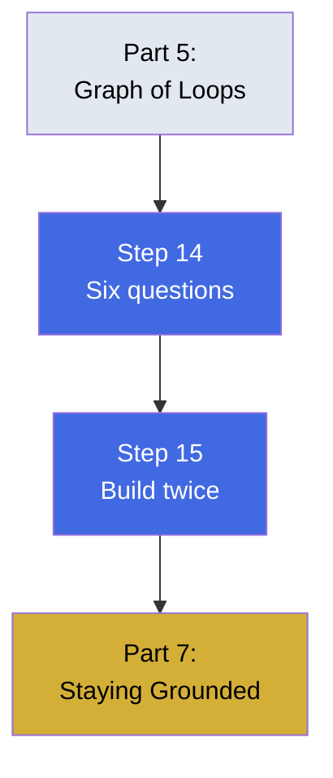

# Part 6 — One Graph, End to End

Deciding when to build a graph and validating the implementation. This part provides the pre-build checklist and a worked example.

## What You'll Learn

Make informed build-or-skip decisions:

- Six questions to answer before committing to a graph
- Building the same system twice to verify correctness
- Recognizing when simpler tools are the right choice

## Contents

1. **[Step 14](step-14-six-questions-before-you-build.md)** — Pre-build checklist: six honest questions
2. **[Step 15](step-15-build-the-same-graph-twice.md)** — Building with two tools to verify correctness

## Diagram

## Learning Thread

**Prerequisites**: Complete Parts 1-5. You should understand the full graph engineering pipeline.

**What this unlocks**: You'll know when to build a graph and when to use simpler alternatives. You'll also know how to validate your implementation.

## Practice

- [Quiz](quiz.md) — Test your understanding

## Check Your Understanding

Can you now:

- ✓ Apply the six-question checklist to any candidate problem
- ✓ Rule out problems that don't justify a graph
- ✓ Build the same system with two different tools
- ✓ Compare outputs to verify correctness

**Ready?** Continue to [Part 7 - Staying Grounded](../09-part-7-staying-grounded/)
