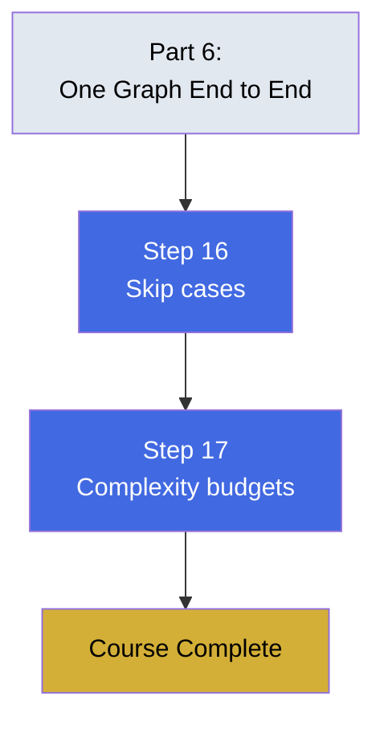

# Part 7 — Staying Grounded

Knowing when to skip graphs and managing complexity budgets. This part teaches judgment: when to build less, and when to build nothing at all.

## What You'll Learn

Make proportionate decisions:

- Four recognizable cases where simpler tools win
- Adding governance only after failures appear
- Keeping complexity proportional to actual need

## Contents

1. **[Step 16](step-16-when-to-skip-graph-engineering-entirely.md)** — Four cases where simpler tools win
2. **[Step 17](step-17-complexity-budgets-and-staying-the-engineer.md)** — Add governance only after failures appear

## Diagram

## Learning Thread

**Prerequisites**: Complete Parts 1-6. You should have built at least one complete graph from extraction to verification.

**What this unlocks**: After this part, you'll know when *not* to build a graph, and how to keep governance proportional to evidence instead of adding it preemptively.

## Practice

- [Quiz](quiz.md) — Test your understanding
- [Flashcards](flashcards.md) — Review key concepts

## Check Your Understanding

After completing this part, you should be able to:

- ✓ Recognize independent work items that need only a queue
- ✓ Identify single-question-single-document problems
- ✓ Distinguish small fixed relationship sets from graph problems
- ✓ Add governance fixes only after their failure modes appear

---

**🎉 Course Complete!**

You've learned the full graph engineering pipeline from first principles. Return to [Start Here](../00-start-here/README.md) to review any section, or explore [Advanced Topics](../advanced/README.md) for deeper dives into specific patterns.
