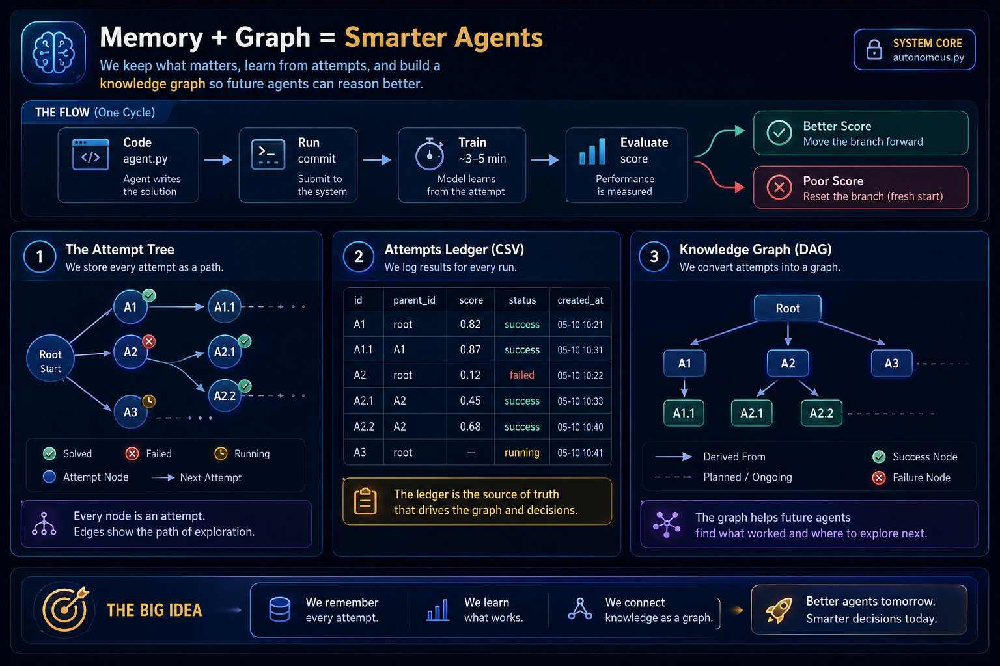

# Graph Engineering Course

---

**You've built a loop. Now scale it to many.**

Complete course on building and managing shared memory graphs for autonomous systems — taking the loop discipline you know (heartbeat, spine, maker-checker) and extending it to coordinate multiple loops safely.

If you completed the [Loop Engineering Crash Course](https://github.com/ayeshakhalid192007-dev/LoopEngineering-CrashCourse), this is the natural next step. If not, start there first — this course assumes you're comfortable with loop vocabulary and ready to scale from one agent to many.

👉 **New here?** Answer 3 quick questions at [00-start-here](00-start-here/README.md)

## Learning Paths

For guided learning by experience level, see [Learning Tracks](00-start-here/learning-tracks.md).

**Quick start:**
- **Core Path:** Steps 1-13 + Projects 1-4 (~2 hours)
- **Advanced Path:** Steps 14-17 + Projects 5-8 + Advanced tier

## Before Part 1

| Section | What it's for |
| --- | --- |
| [`00-start-here/`](00-start-here/README.md) | A short router — 2–3 questions that point you at the right starting page |
| [`01-prerequisites/`](01-prerequisites/README.md) | Confirms you have Loop Engineering and Harness Engineering, with recap primers if you want a refresher |
| [`02-foundations/`](02-foundations/README.md) | Vocabulary and mental models this whole course leans on: the [glossary](02-foundations/glossary.md), [mental models](02-foundations/mental-models.md), [the two-graph split](02-foundations/the-two-graphs.md) at an intro level, and [comprehension debt](02-foundations/concepts.md) |

## The 17-step roadmap

Links below point at where Day 2 of this build will place each step's page. Until then they're placeholders for the shape of the course, not live pages — that's expected at this stage of the build.

### Part 1 — The Memory Problem

1. [Why loops outgrow a single memory file](03-part-1-the-memory-problem/01-why-loops-outgrow-a-single-memory-file.md)
2. [Graphs in plain terms](03-part-1-the-memory-problem/02-graphs-in-plain-terms.md)
3. [Keep your two graphs separate](03-part-1-the-memory-problem/03-keep-your-two-graphs-separate.md)

### Part 2 — The DAG of Work

4. [Recording attempts without losing the trail](04-part-2-the-dag-of-work/04-recording-attempts-without-losing-the-trail.md)
5. [Letting failed branches stay queryable](04-part-2-the-dag-of-work/05-letting-failed-branches-stay-queryable.md)

### Part 3 — The Graph of Facts

6. [Extraction: schema first, prose second](05-part-3-the-graph-of-facts/06-extraction-schema-first-prose-second.md)
7. [Resolution: merging without losing the evidence](05-part-3-the-graph-of-facts/07-resolution-merging-without-losing-the-evidence.md)
8. [Provenance: every claim keeps a receipt](05-part-3-the-graph-of-facts/08-provenance-every-claim-keeps-a-receipt.md)

### Part 4 — Working From the Graph

9. [Subgraphs: give a worker a slice, not the graph](06-part-4-working-from-the-graph/09-subgraphs-give-a-worker-a-slice-not-the-graph.md)
10. [The grounded checker](06-part-4-working-from-the-graph/10-the-grounded-checker.md)

### Part 5 — The Graph of Loops

11. [Wiring loops together](07-part-5-the-graph-of-loops/11-wiring-loops-together.md)
12. [Four ways a lone loop fails itself](07-part-5-the-graph-of-loops/12-four-ways-a-lone-loop-fails-itself.md)
13. [Anchors and frozen nodes](07-part-5-the-graph-of-loops/13-anchors-and-frozen-nodes.md)

### Part 6 — One Graph, End to End

14. [Six questions before you build](08-part-6-one-graph-end-to-end/14-six-questions-before-you-build.md)
15. [Build the same graph twice](08-part-6-one-graph-end-to-end/15-build-the-same-graph-twice.md)

### Part 7 — Staying Grounded

16. [When to skip graph engineering entirely](09-part-7-staying-grounded/16-when-to-skip-graph-engineering-entirely.md)
17. [Complexity budgets and staying the engineer](09-part-7-staying-grounded/17-complexity-budgets-and-staying-the-engineer.md)

## Learning progression

After Part 7, continue with structured practice and reference material:

| Section | What it's for |
| --- | --- |
| [`10-methods/`](10-methods/README.md) | The build-a-graph method, the pattern picker, and the pre-build decision framework |
| [`11-operating/`](11-operating/README.md) | Anti-patterns, failure modes, safety notes, and observability guidance |
| [`advanced/`](advanced/README.md) | The Ultra-Pro (G4) tier: scale, federation, and org-level governance |
| [`projects/`](projects/README.md) | The eight hands-on projects, from a first hand-drawn graph to the two-loop capstone |
| [`appendix/cheatsheets/`](appendix/cheatsheets/README.md) | Quick-reference sheets per tool |
| [`assessments/`](assessments/README.md) | The final exam, capstone rubric, and Graph Ready certification |

## Patterns and starter kits

Runnable material lives outside `docs/` at the repo root: [`patterns/`](../patterns/README.md) for the pattern catalog and [`starters/`](../starters/README.md) for clone-and-run kits. Full attribution for every idea this course draws on is in [`resources/sources.md`](../resources/sources.md).
