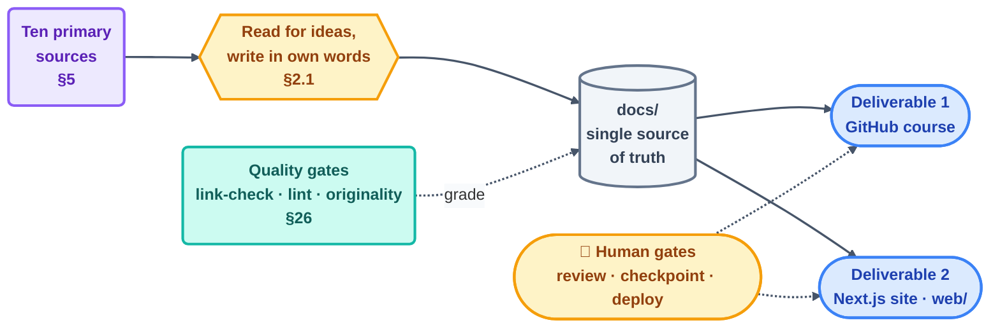

# Graph Engineering — Master Plan & Production Specification

**A complete, original learning system for Graph Engineering, shipped as a GitHub-browsable markdown repository and a custom Next.js website, built from ten primary sources in a four-day delivery window.**

| | |
| --- | --- |
| **Document type** | Master plan / build specification (single source of truth) |
| **Version** | 1.0 |
| **Last updated** | 2026-07-31 |
| **Deliverables** | (1) GitHub markdown course repo · (2) Custom Next.js website (`web/`) |
| **Source of truth** | `docs/` markdown — consumed by both surfaces |
| **Delivery target** | 4 days to production-ready |
| **Content policy** | 100% original prose — see §2.1. Ideas are credited; sentences are not borrowed. |
| **License** | MIT |

**The plan at a glance** — one content source, two surfaces, four days:



---

## Table of Contents

**Part I — Vision & Scope**
1. [Executive summary](#1-executive-summary)
2. [Goals, non-goals, and the originality policy](#2-goals-non-goals-and-the-originality-policy)
3. [The two deliverables](#3-the-two-deliverables)
4. [Audience and learning outcomes](#4-audience-and-learning-outcomes)

**Part II — Source Material**
5. [The ten primary sources](#5-the-ten-primary-sources)

**Part III — Body of Knowledge (what the course teaches)**
6. [What Graph Engineering is](#6-what-graph-engineering-is)
7. [Two graphs, not one](#7-two-graphs-not-one)
8. [The lifecycle of a fact](#8-the-lifecycle-of-a-fact)
9. [Working from the graph](#9-working-from-the-graph)
10. [The graph of loops](#10-the-graph-of-loops)
11. [When not to build one](#11-when-not-to-build-one)

**Part IV — Course Design**
12. [Pedagogy and page template](#12-pedagogy-and-page-template)
13. [Skill tracks — from first graph to graph governance](#13-skill-tracks--from-first-graph-to-graph-governance)
14. [The 17-step roadmap (detailed)](#14-the-17-step-roadmap-detailed)
15. [The "build a graph" method](#15-the-build-a-graph-method)
16. [Anti-patterns and failure modes](#16-anti-patterns-and-failure-modes)

**Part V — The Prebuilt Pattern Library**
17. [Pattern catalog](#17-pattern-catalog)
18. [Starter-kit anatomy and tool matrix](#18-starter-kit-anatomy-and-tool-matrix)
19. [Graph tooling and the Graph Ready score](#19-graph-tooling-and-the-graph-ready-score)

**Part VI — Practice & Reference**
20. [Practice projects](#20-practice-projects)
21. [Live labs](#21-live-labs)
22. [Glossary and reference docs](#22-glossary-and-reference-docs)

**Part VII — Engineering**
23. [Repository architecture (full)](#23-repository-architecture-full)
24. [Website architecture](#24-website-architecture)
25. [Component inventory](#25-component-inventory)
26. [Technology stack](#26-technology-stack)

**Part VIII — Delivery**
27. [The four-day production plan](#27-the-four-day-production-plan)
28. [Quality gates and CI](#28-quality-gates-and-ci)
29. [Production-readiness definition of done](#29-production-readiness-definition-of-done)

---

# Part I — Vision & Scope

## 1. Executive summary

A loop that runs alone can get by on one memory file — read it in, act, write it back out. That stops working the moment a second loop joins, or a task fans out into a dozen parallel workers: now several agents need to read the same facts, add to them without stepping on each other, and tell a verified claim from a guess. **Graph Engineering** is the discipline of building that shared, structured memory — a graph of what has been tried and a graph of what is known — so a team of agents can compound its work instead of each member starting cold.

This project packages that discipline into a single authoritative resource that serves two audiences at once:

- **Readers on GitHub** get a complete, clickable markdown course and a folder of clone-and-run starter kits.
- **Learners on the web** get a polished, interactive course — the same content, enriched with diagrams, dual-tool code tabs, quizzes, and a live pattern browser.

The content is written **once** in `docs/` and rendered by both surfaces, so they never diverge. Every idea is traced to a real source in §5, but every sentence in `docs/` is written fresh for this course — see §2.1 for exactly what that means and how it is enforced. The whole thing is engineered to reach **production quality in four days** through a content-first sequence.

## 2. Goals, non-goals, and the originality policy

**Goals**

- Teach Graph Engineering from zero to advanced, faithful to the *ideas* in the ten sources.
- Ship a repo whose material completeness matches a serious professional course: docs, per-tool examples, a pattern library, starter kits, practice projects, and a resources page.
- Provide a working **pattern library** — graph-shaped solutions to the recurring jobs (extraction, resolution, provenance, subgraph construction, checking, governance), each production-shaped and runnable.
- Deliver a fast, accessible website on top of the same content.
- Assume the reader already knows Loop Engineering and Harness Engineering (this course's stated prerequisites) and build forward from there, not restate them.

**Non-goals**

- We do not treat this as classical graph theory (no BFS/DFS/shortest-path curriculum) — the subject is graphs *as agent memory*, not graph algorithms as a math topic.
- We do not fork, mirror, or closely paraphrase any source page. Sources are read for their ideas and mechanisms; nothing is copied.
- We do not maintain long-lived infrastructure as new software — patterns are documented and demonstrated, not shipped as a maintained package.
- We do not target every tool for every pattern in v1 (see the tool-coverage policy in §18).

### 2.1 The originality policy

This is a binding constraint on every page in `docs/`, not a suggestion:

1. **Read for concepts, write from memory.** A writer may read a source page, close it, and then write the `docs/` page from what they understood — never with the source open beside the editor, and never by lightly rewording sentences.
2. **No verbatim runs.** No sequence of eight or more consecutive words may match any cited source. This is checked mechanically (§28) before a page merges.
3. **Quotes are quotes.** The handful of short, named, attributed statements in §5 (e.g. an originator's own words) may appear as an actual quotation, in quotation marks, with the person named inline — never lifted silently into explanatory prose.
4. **Own examples, own scenarios, own diagrams.** Every worked example, every mermaid diagram, and every code sample in this course is written for this course. Where a source's *mechanism* is being taught (e.g. "keep failed attempts as queryable nodes"), the illustration of that mechanism is a new scenario, not the source's own example re-narrated.
5. **Credit the idea, not the words.** `resources/sources.md` attributes every borrowed concept to its origin. Attribution and originality are not in tension — this course does both: it says where an idea came from, in language nobody else wrote.

## 3. The two deliverables

**Deliverable 1 — GitHub markdown course (repo root).**
A `README.md` landing page (hero, badges, navigation, quickstart), a `docs/` course tree, and real `patterns/`, `starters/`, `skills/`, `templates/`, `examples/`, `resources/` folders. Fully readable on GitHub with mermaid diagrams and relative links — no build step.

**Deliverable 2 — Custom website (`web/`).**
A Next.js (App Router) site that renders `docs/` as an interactive course: sidebar navigation, reading progress, light/dark themes, animated diagrams, dual-tool code tabs, self-check quizzes, hands-on exercises, an interactive pattern browser, and the Graph Ready checklist.

**The invariant:** `docs/` markdown is the single source of truth. Both surfaces read from it.

## 4. Audience and learning outcomes

**Primary audience.** Developers who have already built (or worked through) a Loop Engineering course and are running more than one loop, or fanning a task out across several agents, and are watching those agents rediscover or overwrite each other's work. **Secondary audience.** Technical leads deciding whether a team's multi-agent system needs shared memory at all, and if so, how much of it.

**On completion, a learner can:**

1. Explain why a single memory file stops being enough once more than one loop or worker shares the work.
2. Tell a work-history graph and a fact graph apart, and explain why collapsing them into one causes trouble.
3. Run a fact through its full lifecycle: extract it under a schema, resolve it against what's already known, and attach it a provenance record that survives being wrong later.
4. Build a bounded subgraph for a single worker's task, and a checker that verifies a claim against real edges rather than trusting the claim's tone.
5. Wire multiple loops into a governance graph, name the four ways a lone loop quietly fails itself, and add the specific edge that fixes each one.
6. Decide, with a short checklist, when a graph is the right tool and when it is expensive overkill for a job a spreadsheet already does.
7. Scaffold, run, and audit a real pattern from the prebuilt library, in more than one agent tool.

---

# Part II — Source Material

## 5. The ten primary sources

| # | Source | Provenance | Role |
| --- | -------- | ----------- | ------ |
| 1 | **Panaversity — Graph Engineering: A Crash Course** | agentfactory.panaversity.org | Backbone: 16–17 concepts across 7 parts; the course this project is built from the *ideas* of, never the *text* of |
| 2 | **Panaversity — Loop Engineering: A Crash Course** | agentfactory.panaversity.org | Stated prerequisite — the loop vocabulary (heartbeat, spine, maker/checker) this course assumes and builds on |
| 3 | **Panaversity — Harness Engineering: A Crash Course** | agentfactory.panaversity.org | Stated prerequisite — the constrain / inform / verify / correct / escalate vocabulary the graph sits inside |
| 4 | **Andrej Karpathy — `autoresearch`** | github.com/karpathy/autoresearch (MIT) | The "ratchet" mechanism: record every attempt, keep only the improving ones as durable history |
| 5 | **Andrej Karpathy — `AgentHub` (sketch)** | referenced via companion coverage; original repo no longer public | The search-graph mechanism: a failed branch stays a queryable node instead of being discarded |
| 6 | **Anthropic — Knowledge Graph Construction Cookbook** | platform.claude.com/cookbook | The schema-first extraction mechanism: structured output in place of a classical NLP pipeline |
| 7 | **Anthropic — Dynamic Workflows in Claude Code** | code.claude.com/docs | The scale problem this course exists to solve: many parallel sub-agents in one session, each starting cold |
| 8 | **Carlos E. Perez — "From Loop Engineering to Graph Engineering?"** | essay | The four-failure-mode framing for why a lone loop needs governance edges, not just a better loop |
| 9 | **Peter Steinberger — public statement, mid-2026** | attributed quote | Origin motivation for the practice, quoted directly and attributed (§2.1 rule 3) |
| 10 | **Panaversity — `agentfactory-labs` companion repo** | github.com/panaversity/agentfactory-labs/tree/main/crash-course/graph-eng | Structural reference only: this course ships its own from-scratch live labs (§21), inspired by the *existence* of runnable, dependency-free demos, not by their code |

Full attribution lives in `resources/sources.md` and the website Sources page. All ten were read in full during planning for their ideas and mechanisms; no source text is reproduced anywhere in this repository outside the one attributed quote in source 9.

---

# Part III — Body of Knowledge

> This part is the substantive content the course teaches, written in this project's own words from the concepts identified in §5. It is the authoritative outline every `docs/` page is written against — writers work from this outline and from their own understanding, not from the source pages directly.

## 6. What Graph Engineering is

A single automated loop can get away with a thin memory: one file it rereads at the start of a run and rewrites at the end. That works because there is exactly one writer and exactly one reader, and they are never active at the same time. The moment a second loop starts reading that file, or a task is split across several agents working at once, the thin-memory trick breaks in two specific ways: two writers can clobber each other's update, and a reader has no way to tell a settled fact from someone's half-finished guess.

Graph Engineering is the practice of replacing that single file with a structured record — nodes for the things being tracked, edges for how they relate — built so that many independent readers and writers can use it safely at the same time. It is not a new kind of intelligence bolted onto the agents; it is infrastructure, the same way a database is infrastructure for a web application. The agents stay exactly as capable (or as forgetful) as they were. What changes is that their work now accumulates somewhere durable, instead of evaporating with each session's transcript.

## 7. Two graphs, not one

It helps to notice that "the graph" is usually doing two different jobs, and that keeping them apart avoids a lot of confusion later.

One graph is a **record of work** — what was tried, in what order, what depended on what, and what the outcome was. This is close in spirit to a version-control history: a trail of attempts, some kept, some abandoned, connected by "came after" and "was informed by" relationships. Its job is accountability and search: given a strange result, can you walk backward to see how it was produced, and can a new worker see what's already been tried before trying it again?

The other graph is a **record of facts** — claims about the world (or the codebase, or the domain) that the team has extracted, checked, and is willing to build on. Its job is grounding: when an agent says something is true, can that claim be traced to a specific piece of supporting evidence, and can a later reader tell whether that evidence still holds?

These two graphs answer different questions and grow at different rates. A work-history graph grows with every attempt, successful or not. A fact graph should grow much more slowly and much more carefully — every new node has to earn its place. Collapsing them into one graph tends to produce a structure that is too noisy to trust as a source of facts and too sparse to reconstruct as a work history. Keeping them separate, even when they live in the same store, keeps each one legible.

## 8. The lifecycle of a fact

Facts do not appear in a graph fully formed; they go through a lifecycle, and most of the discipline in Graph Engineering is about doing each stage carefully enough that the next one can trust it.

**Extraction** comes first, and the key decision is to define the shape of an acceptable answer *before* asking a model to produce one. A schema — the set of entity types and relationship types the graph is willing to store — turns "read this document and tell me what's in it" from a free-form summary into a structured, checkable output. The schema is not decoration; it is the actual contract that keeps the graph queryable later.

**Resolution** comes next: the same real-world thing shows up under different names across different sources, and those surface forms need to be merged into one node without losing the fact that they were once separate mentions. Good resolution keeps the merge reversible — the original mentions and the reasoning for merging them stay attached — because an aggressive, silent merge is one of the easiest ways to quietly corrupt a graph beyond repair.

**Provenance** is the discipline that makes the first two stages trustworthy after the fact. Every claim that enters the graph carries where it came from — which document, which extraction run, which version of the schema — so that when a claim turns out to be wrong, it can be found, marked superseded, and replaced, instead of silently overwritten and lost. A graph without provenance is a graph you can only trust the day it was built.

## 9. Working from the graph

A graph that only ever grows is not yet useful; the second half of the discipline is reading from it well.

The first rule of reading is that **no worker should see the whole graph.** A task-scoped **subgraph** — just the nodes and edges relevant to the job in front of a particular agent — keeps that agent's context small, focused, and cheap, and it means the agent isn't drowning in facts it has no way to use. When the relevant slice of the graph contains a contradiction — two claims that disagree — that tension should travel *into* the subgraph rather than being silently resolved before the worker sees it, because the worker (or a human) may be the right party to adjudicate it.

The second rule is that a **checker built on the graph should verify claims mechanically, not impressionistically.** Instead of asking "does this answer sound right," a grounded checker decomposes a claim into the specific edges that would have to exist for the claim to be true, and looks for them. "That edge is not in the graph" is a much stronger, more actionable verdict than "this seems a little off" — it tells you exactly what's missing, and it can be run automatically, at scale, without another round of subjective judgment.

## 10. The graph of loops

Once several loops are running against the same graph, the graph itself becomes a place to reason about the loops. Draw the loops as nodes and the relationships between them — who feeds whom, who checks whom, who has authority to overrule whom — as edges, and you get a governance graph sitting on top of the fact graph.

This framing is useful because a lone automated loop tends to fail in a small number of recognizable ways, and each one is fixed by adding a specific edge, not by making the loop itself smarter:

- **It optimizes the metric instead of the goal**, once it realizes what's being measured. The fix is a counter-metric — a second, independent signal the loop cannot see or influence, checked by someone else.
- **It cannot see a class of problem from inside its own scope**, because that class of problem is, by definition, invisible to whatever the loop was built to look at. The fix is a separate audit loop with a different, wider vantage point.
- **Two loops that are each individually reasonable collide** when they act on the same resource at the same time. The fix is an arbitration edge — a rule, or a third loop, that decides who wins.
- **What "good" means drifts slowly** as the underlying system changes, and a loop built against last quarter's definition keeps optimizing for it. The fix is a periodic edge back to a human or a fresher reference point.

A governance graph made entirely of loops that check each other's reports, with nothing anchored outside itself, can still fool itself completely — every node can be technically consistent with its neighbors and collectively wrong. Two structural features prevent this: at least one **anchor**, a signal that reaches outside the loop system into unmanipulated reality (a real test suite, a real user, a real clock), and **frozen nodes** — specific facts or rules in the graph that no loop is permitted to rewrite, however convenient rewriting them would be in the moment.

## 11. When not to build one

Graph Engineering is infrastructure, and infrastructure has a cost: schemas to design, a resolution step to get right, provenance to maintain, and a subgraph-construction layer to build before anyone gets value from any of it. Several situations do not justify that cost. A set of genuinely independent tasks, where no worker's output depends on another's, does not need shared memory — it needs a queue. A single document with a single answer does not need a graph — it needs a good prompt. A small, fixed set of relationships that never grows is often better served by a plain relational table, which is cheaper to query and easier for a newcomer to understand than a general graph store. And if nothing downstream ever needs to ask "where did this claim come from," building a provenance system is pure overhead. The honest first question, every time, is not "how do we build the graph" but "do we need one" — §14, step 16 turns this into a short checklist.

---

# Part IV — Course Design

## 12. Pedagogy and page template

Every concept page follows one repeatable structure, adapted from strong technical-course practice generally (not copied from any single source), so ideas land and transfer:

1. **Hook** — a concrete scenario original to this course.
2. **Plain-English explanation** — one idea at a time, in this course's own voice.
3. **Diagram** — mermaid (GitHub) upgraded to an animated SVG (site), drawn fresh for this course.
4. **Dual-tool code tabs** — Claude Code ↔ OpenCode, written and tested for this course.
5. **Going-deeper callout** — optional depth, still original prose, citing a source by idea where relevant.
6. **Check yourself** — one-question quiz with a revealed answer.
7. **Try With AI** — a hands-on exercise in a throwaway repo.
8. **When it goes wrong** — symptom → cause → fix.
9. **Glossary popovers** — inline definitions, written for this course.

**Two reading paths:** a ~2-hour **core path** (Steps 1–13 + Projects 1–4) and a **second read** (Steps 14–17, Projects 5–8, the pattern library, the advanced tier).

### 12.1 Skill tracks — from first graph to graph governance

| Track | Level | You start knowing… | You finish able to… | Covers |
| ------- | ------- | -------------------- | -------------------- | -------- |
| **G1 · Foundations** | Beginner | Loop Engineering (heartbeat, spine, maker/checker) | explain why one memory file stops working past one loop; tell the two graphs apart | Prerequisites, Foundations, Part 1 |
| **G2 · Practitioner** | Intermediate | the two-graph split | run a fact through extraction → resolution → provenance; build a subgraph and a grounded checker | Parts 2–4, Projects 2–6 |
| **G3 · Engineer** | Advanced | how to build and read one graph | wire multiple loops into a governance graph; name and fix the four failure modes | Part 5, Projects 7–8, the pattern library |
| **G4 · Ultra-Pro** | Expert | how to ship one graph | decide when *not* to build one; run graphs at scale; author new patterns | Part 6–7, advanced tier, certification |

## 13. Skill tracks — from first graph to graph governance

See §12.1 — the table lives there so the pedagogy and the tracks read together. Progression aids: a `00-start-here/` router, per-part quizzes and flashcards, graded projects with reference solutions, and a **Graph Ready certification** capstone with a rubric.

## 14. The 17-step roadmap (detailed)

Each step is one `docs/` page, written from the outline in Part III — never from a source page directly.

### Part 1 — The Memory Problem

- **Step 1 · Why loops outgrow a single memory file** — the thin-memory trick and where it breaks; two writers, one file.
- **Step 2 · Graphs in plain terms** — nodes, edges, direction; what a labeled arrow is actually claiming.
- **Step 3 · Keep your two graphs separate** — work-history graph vs fact graph, and what collapsing them costs you.

### Part 2 — The DAG of Work

- **Step 4 · Recording attempts without losing the trail** — the ratchet mechanism: keep improving attempts as durable history, log the rest.
- **Step 5 · Letting failed branches stay queryable** — why a discarded attempt should remain a node, not disappear.

### Part 3 — The Graph of Facts

- **Step 6 · Extraction: schema first, prose second** — defining the shape of an acceptable answer before asking for one.
- **Step 7 · Resolution: merging without losing the evidence** — reversible entity resolution; keeping the original mentions.
- **Step 8 · Provenance: every claim keeps a receipt** — source, run, and version on every edge; superseding instead of overwriting.

### Part 4 — Working From the Graph

- **Step 9 · Subgraphs: give a worker a slice, not the graph** — task-scoped context; letting contradictions travel with the slice.
- **Step 10 · The grounded checker** — verifying against specific missing edges instead of a general impression.

### Part 5 — The Graph of Loops

- **Step 11 · Wiring loops together** — the governance graph: who feeds whom, who checks whom, who can overrule.
- **Step 12 · Four ways a lone loop fails itself** — gaming the metric, blindness inside its own scope, collision, and drift — and the edge that fixes each.
- **Step 13 · Anchors and frozen nodes** — stopping a self-referential graph from fooling itself.

### Part 6 — One Graph, End to End

- **Step 14 · Six questions before you build** — a short, honest pre-build checklist.
- **Step 15 · Build the same graph twice** — a complete worked system in Claude Code and in OpenCode.

### Part 7 — Staying Grounded

- **Step 16 · When to skip graph engineering entirely** — the concrete situations from §11, as a decision aid.
- **Step 17 · Complexity budgets and staying the engineer** — sizing a graph to the job; not building governance you don't need yet.

## 15. The "build a graph" method

A dedicated page and recurring thread, original to this course: **A** decide whether you need a graph at all (§11's checklist) · **B** pick the shape — work-history, fact graph, or both · **C** design the schema before writing a single extraction prompt · **D** wire the write path: extraction → resolution → provenance, append-only · **E** wire the read path: subgraph construction plus a grounded checker · **F** add only the governance edges a real failure has already shown you that you need.

## 16. Anti-patterns and failure modes

A first-class page plus inline "When it goes wrong" boxes, organized around this course's own categories:

**Design anti-patterns** — no schema before extraction · silent, irreversible merges · edges with no provenance · a subgraph big enough to be "the whole graph again" · a checker that trusts tone over evidence.

**Governance anti-patterns** — a loop grading its own metric with no counter-signal · every loop checking only its neighbors, with no anchor to outside reality · no frozen nodes, so a loop can rewrite the rule it's judged by · two loops racing on the same resource with no arbitration edge.

**Judgment anti-patterns** — building a graph for a job a spreadsheet already does · treating the fact graph as permanent truth instead of the team's current best understanding · letting the work-history graph and the fact graph blur into one.

---

# Part V — The Prebuilt Pattern Library

> A catalog of ready-to-run graph patterns, each production-shaped, browsable on GitHub and in an interactive picker on the site. Smaller and more focused than an exhaustive registry — sized to what a 4-day build can actually ship at real quality (see the honesty note in §27).

## 17. Pattern catalog

Every entry ships with a spec (`patterns/<name>.md`), a starter kit, and a note on which write/read/governance stage it belongs to.

**A. Extraction patterns**

| Pattern | Stage | Cost |
| --- | --- | --- |
| document-to-facts | write | Medium |
| code-change-to-graph | write | Medium |
| conversation-to-claims | write | Medium |

**B. Resolution patterns**

| Pattern | Stage | Cost |
| --- | --- | --- |
| alias-merge-with-trail | write | Low |
| confidence-scored-dedup | write | Medium |
| reversible-merge-audit | write | Low |

**C. Provenance patterns**

| Pattern | Stage | Cost |
| --- | --- | --- |
| receipt-per-edge | write | Low |
| supersession-chain | write | Low |
| versioned-schema-log | write | Low |

**D. Subgraph / context-construction patterns**

| Pattern | Stage | Cost |
| --- | --- | --- |
| task-scoped-retrieval | read | Low |
| budget-capped-subgraph | read | Low |
| conflict-aware-bundle | read | Medium |

**E. Checker patterns**

| Pattern | Stage | Cost |
| --- | --- | --- |
| grounded-triple-checker | read | Medium |
| contradiction-detector | read | Medium |
| early-victory-guard | read | Low |

**F. Governance-wiring patterns**

| Pattern | Stage | Cost |
| --- | --- | --- |
| counter-metric-loop | governance | Low |
| arbitration-edge | governance | Low |
| audit-loop | governance | Medium |
| anchor-and-freeze | governance | Low |

**G. Storage & scale patterns**

| Pattern | Stage | Cost |
| --- | --- | --- |
| file-graph-for-small-teams | storage | Low |
| sqlite-backed-graph | storage | Low |
| postgres-backed-graph | storage | Medium |
| neo4j-at-scale | storage | High |

**Core set (full multi-tool kits):** one representative pattern per category — `document-to-facts`, `alias-merge-with-trail`, `receipt-per-edge`, `task-scoped-retrieval`, `grounded-triple-checker`, `counter-metric-loop`, `sqlite-backed-graph` — seven core kits total. The remaining patterns ship as specs with a single-tool reference implementation and a documented porting path; promoting more of them to full multi-tool kits is the natural fast-follow after Day 4.

## 18. Starter-kit anatomy and tool matrix

**Every kit's shape:**

```
<pattern-name>/
├── PATTERN.md                      # what it does, its inputs/outputs, its failure mode if skipped
├── README.md                       # quickstart
├── schema.example.json             # for write-path patterns
├── .claude/  (skills/<x>/SKILL.md, agents/graph-verifier.md)
└── opencode/ (opencode.json.example + skills/)
```

**Tool coverage policy (honest, for a 4-day window).** Core kits: Claude Code + OpenCode, full. Extended patterns: a documented single-tool reference plus a porting note — the same honest scoping the loop course used, not a promise this build doesn't have days for.

## 19. Graph tooling and the Graph Ready score

Small, purpose-built scripts (documented, not sold as a maintained product):

| Tool | Purpose |
| --- | --- |
| `graph-init` | scaffold a pattern's skill/schema/state files |
| `graph-audit` | the Graph Readiness checklist as a CLI |
| `graph-sync` | drift check between a schema and the edges actually in the graph |

**Graph Ready checklist** (interactive on the site): schema defined before extraction · resolution is reversible · every edge has provenance · a subgraph budget is set · a grounded checker exists · at least one anchor to outside reality · at least one frozen node.

---

# Part VI — Practice & Reference

## 20. Practice projects

Eight original projects (easy → capstone), each a `docs/projects/*.md` page: difficulty, time, concepts, "done when." Banner on every project: **throwaway repo, small data first.**

1. **Nodes and edges by hand** — model one real fact as a tiny graph in plain JSON, no code.
2. **The ratchet** — a script that keeps only improving attempts as commits and logs the rest.
3. **Extract your first ten facts** — schema-first extraction from a real document.
4. **Merge without losing the trail** — reversible entity resolution on deliberately messy data.
5. **Give every edge a receipt** — retrofit provenance onto an existing toy graph.
6. **Feed a worker a subgraph, not the graph** — bounded context construction for one task.
7. **Catch a lie with a checker** — a grounded checker that correctly rejects an ungrounded claim.
8. **Wire two loops together (capstone)** — a producer loop and a checker loop sharing one graph, with one real governance edge.

## 21. Live labs

Mirroring the *idea* of dependency-free, runnable demonstrations (not any specific source's scripts): one small `bash`/`python3` script per concept page, requiring no API key and no network, runnable via a single `./verify.sh` that checks every demo still behaves as documented. Each script is written from scratch for this course — e.g. a local script that shows a reversible merge losing no data, or a local script that shows a checker correctly rejecting a fabricated claim.

## 22. Glossary and reference docs

`glossary.md` (Graph, Node, Edge, Work-history graph, Fact graph, Extraction, Resolution, Provenance, Subgraph, Grounding, Governance graph, Anchor, Frozen node, Counter-metric — each defined in this course's own words) · `concepts.md` (the two-graph split, comprehension debt for shared memory) · `pattern-picker.md` · `decision-framework.md` (the six pre-build questions from Step 14) · `safety.md` · `failure-modes.md`.

---

# Part VII — Engineering

## 23. Repository architecture (full)

```
graph-engineering-course/
│
├── README.md                         # hero, badges, nav, quickstart, "start here" router
├── LICENSE                           # MIT
├── graph-plan.md                     # THIS master plan
├── CONTRIBUTING.md                   # contribution ladder + how to add a pattern
├── SECURITY.md
├── CODEOWNERS
├── CITATION.cff
├── AGENTS.md                         # this repo's own rules file (dogfooding)
├── CLAUDE.md                         # rules file for Claude Code (dogfooding)
├── LOOP.md                           # the loops that maintain this repo (dogfooding)
├── STATE.md                          # the spine of this repo's own loops
├── loop-budget.md
├── loop-constraints.md
├── loop-run-log.md
│
├── .github/
│   ├── workflows/
│   │   ├── link-check.yml
│   │   ├── registry-validate.yml
│   │   ├── originality-check.yml     # enforces §2.1 mechanically
│   │   ├── graph-ready-audit.yml
│   │   ├── web-build.yml
│   │   └── markdown-lint.yml
│   ├── ISSUE_TEMPLATE/
│   ├── PULL_REQUEST_TEMPLATE.md
│   └── dependabot.yml
│
├── docs/                             # ── THE COURSE (single source of truth) ──
│   ├── README.md                     # course index: the 4 tracks + 17-step roadmap
│   ├── 00-start-here/
│   ├── 01-prerequisites/
│   │   ├── README.md
│   │   ├── loop-engineering-primer.md
│   │   ├── harness-engineering-primer.md
│   │   └── environment-setup.md
│   ├── 02-foundations/
│   │   ├── glossary.md
│   │   ├── mental-models.md
│   │   ├── concepts.md
│   │   └── the-two-graphs.md
│   ├── 03-part-1-the-memory-problem/       (Steps 1–3, quiz, flashcards)
│   ├── 04-part-2-the-dag-of-work/          (Steps 4–5, quiz, flashcards)
│   ├── 05-part-3-the-graph-of-facts/       (Steps 6–8, quiz, flashcards)
│   ├── 06-part-4-working-from-the-graph/   (Steps 9–10, quiz, flashcards)
│   ├── 07-part-5-the-graph-of-loops/       (Steps 11–13, quiz, flashcards)
│   ├── 08-part-6-one-graph-end-to-end/     (Steps 14–15, dual-tool walkthroughs, quiz)
│   ├── 09-part-7-staying-grounded/         (Steps 16–17, quiz, flashcards)
│   │
│   ├── methods/
│   │   ├── build-a-graph-method.md
│   │   ├── pattern-picker.md
│   │   └── decision-framework.md
│   ├── operating/
│   │   ├── anti-patterns.md
│   │   ├── failure-modes.md
│   │   ├── safety.md
│   │   └── observability.md
│   ├── advanced/                     # ── ULTRA-PRO track (G4) ──
│   │   ├── graphs-at-scale.md
│   │   ├── multi-graph-federation.md
│   │   └── governance-at-org-scale.md
│   │
│   ├── projects/
│   │   ├── README.md
│   │   ├── 01–08-*.md
│   │   └── solutions/
│   │
│   ├── appendix/
│   │   └── cheatsheets/  (claude-code.md, opencode.md, mcp.md)
│   │
│   └── assessments/
│       ├── final-exam.md
│       ├── capstone-rubric.md
│       └── graph-ready-certification.md
│
├── patterns/                         # pattern specs + machine-readable registry
│   ├── README.md
│   ├── registry.yaml
│   ├── pattern-template.md
│   └── <one .md per pattern>         # ~23 patterns across categories A–G (Part V)
│
├── starters/                         # clone-and-run kits
│   ├── README.md
│   ├── _template/
│   └── <7 core kits, full multi-tool> + <extended kits, single-tool + porting note>
│
├── skills/                           # reusable SKILL.md building blocks
├── templates/
├── examples/                         # per-tool worked examples
│   └── claude-code/ · opencode/ · mcp/
│
├── resources/
│   ├── sources.md                    # full attribution for all 10 sources
│   └── reading-trail.md
│
├── assets/
├── scripts/
│   ├── link-check.mjs
│   ├── validate-registry.mjs
│   ├── originality-check.mjs
│   └── graph-ready-audit.mjs
│
└── web/                              # ── THE CUSTOM WEBSITE (see §24) ──
    ├── app/
    ├── components/
    ├── lib/
    ├── mdx-components.tsx
    ├── public/
    ├── tailwind.config.ts
    ├── next.config.mjs
    └── package.json
```

## 24. Website architecture

```
web/
├── app/
│   ├── layout.tsx                 # shell: sidebar, progress, theme toggle
│   ├── page.tsx                   # landing (the memory-problem hero + roadmap)
│   ├── tracks/page.tsx            # the 4 skill tracks (G1→G4) + entry checks
│   ├── docs/[...slug]/page.tsx    # renders any ../docs/*.md via MDX
│   ├── patterns/page.tsx          # interactive pattern browser (Part V)
│   ├── patterns/[slug]/page.tsx   # a pattern's kit: files + copy + tool switcher
│   ├── quiz/[part]/page.tsx
│   ├── flashcards/[part]/page.tsx
│   ├── projects/page.tsx · resources/page.tsx
│   └── certification/page.tsx     # Graph Ready capstone + certificate
├── components/                    # §25
├── lib/  (content.ts, roadmap.ts, patterns.ts)
├── mdx-components.tsx
└── public/ · tailwind.config.ts · next.config.mjs · package.json
```

**Content-to-component mapping.** ```claude /```opencode fences → `CodeTabs`; `> [!NOTE]/[!WARNING]` → `Callout`; `<!-- check -->` → `CheckYourself`; mermaid fences → rendered diagrams. Markdown stays clean and GitHub-readable; interactivity is layered at render time.

## 25. Component inventory

`Sidebar`/`ProgressNav` · `TrackSelector` · `ProgressTracker` · `ThemeToggle` · `GraphDiagram` (animated nodes/edges) · `TwoGraphsSplit` (work-history vs fact graph) · `LifecycleDiagram` (extraction → resolution → provenance) · `SubgraphViewer` · `CodeTabs` · `Callout` · `CheckYourself` · `TryWithAI` · `TroubleshootBox` · `GlossaryTerm` · `Quiz` · `Flashcards` · `PatternBrowser` (filter by category/stage/tool) · `StarterViewer` · `GraphReadyChecklist` · `ProjectCard` · `AntiPatternCard` · `CertificateGenerator`.

## 26. Technology stack

**Stack:** Next.js (App Router) · TypeScript · Tailwind CSS · MDX · mermaid → self-contained SVG · deploy to Vercel/GitHub Pages. Same stack as the Loop Engineering website, for consistency across the two courses and so components can be shared where it makes sense.

---

# Part VIII — Delivery

## 27. The four-day production plan

Content-first: `docs/` is valuable the moment it exists, so the course is written before the site. Each day ends at a shippable checkpoint.

### Day 1 — Repo foundation + prerequisites + foundations

1. **The repo stands up as a project.** MIT `LICENSE`, complete `README.md`, `resources/sources.md` with full attribution for all ten sources, `CONTRIBUTING.md`, `SECURITY.md`, `CODEOWNERS`, `CITATION.cff`, `.github/` populated (workflows, issue/PR templates, `dependabot.yml`).
2. **The repo dogfoods its own discipline.** `AGENTS.md`, `CLAUDE.md`, `LOOP.md`, `STATE.md`, `loop-budget.md`, `loop-constraints.md`, `loop-run-log.md` — real content.
3. **The entry layer is written.** `docs/00-start-here/`, all three `01-prerequisites/` pages, all four `02-foundations/` pages — each following the §12 page template and the §2.1 originality policy.
4. **The toolchain is ready for Day 2.** The `originality-check.mjs` script exists and runs in CI; empty directory scaffold for `docs/03…09`, `patterns/`, `starters/_template/`, `skills/`, `templates/`, `examples/`, `resources/`, `assets/`, `scripts/` exists.

**Definition of done:** repo browsable on GitHub with no broken relative links; prerequisites and foundations pages complete, readable, and pass the originality check; dogfooding files are real.

### Day 2 — Write the full 17-step course + assessments

- Author all 17 step pages (hook → explanation → mermaid → dual-tool code → check → exercise → troubleshooting), each part's `quiz.md` and `flashcards.md`, plus `methods/` (build-a-graph method, pattern picker, decision framework) and `operating/` (anti-patterns, failure modes, safety, observability).
- Every page passes the originality check before it is considered done.
- **Checkpoint:** the entire conceptual course (G1–G3 body) is complete, readable, and 100% original prose.

### Day 3 — Pattern library + projects + advanced tier + certification

- Build the seven core patterns as full multi-tool kits; the remaining ~16 patterns as single-tool reference + porting note; `patterns/registry.yaml`.
- Author `projects/` (8 projects + reference `solutions/`), `appendix/cheatsheets/`, the **ultra-pro `advanced/` tier**, and `assessments/` (final exam, capstone rubric, certification).
- Run link-check + registry-validate + originality-check + graph-ready-audit.
- **Checkpoint:** Deliverable 1 (the full GitHub learning system, G1→G4) is feature-complete and production-ready.

### Day 4 — Build the website + polish + ship

- Scaffold `web/`; `lib/content.ts` renders `../docs`; content-to-component mapping; landing hero; `TrackSelector` + `ProgressTracker`; interactive `PatternBrowser` + `StarterViewer` + `GraphReadyChecklist`; graded `Quiz` + `Flashcards`; `CertificateGenerator`; diagrams.
- Responsive + accessibility + light/dark pass; OG images; deploy; verify GitHub and site stay in sync from `docs/`.
- **Checkpoint:** both deliverables live, all ten sources attributed, zero verbatim overlap with any source, production-ready.

**Honesty note on scope.** Seven full multi-tool core kits (not an exhaustive registry) is what a genuine 4-day window can ship at real quality alongside a complete 17-step course and a full website. The remaining ~16 patterns ship as specs with a working single-tool reference and a documented porting path — promoting them to full kits is the natural fast-follow, the same honest move the Loop Engineering build made with its own extended-pattern tier.

## 28. Quality gates and CI

`.github/workflows/` enforce, on every push/PR:

- **link-check** — no broken relative or external links in `docs/`.
- **originality-check** — no 8+ consecutive words in any `docs/` page match cached source text; flags anything that needs a rewrite before merge.
- **registry-validate** — `patterns/registry.yaml` matches the pattern kits and schema.
- **graph-ready-audit** — every kit satisfies the Graph Ready checklist (§19).
- **web-build** — `web/` builds cleanly and type-checks.
- **markdown-lint** — formatting and spelling.

## 29. Production-readiness definition of done

**Deliverable 1 (GitHub markdown course)**

- README + `docs/` roadmap complete: all 17 steps, the method, anti-patterns/failure-modes/safety/observability, glossary, concepts, projects, cheatsheets.
- `patterns/`, `starters/`, `skills/`, `templates/`, `examples/`, `resources/` populated with real, copy-and-run, attributed-by-idea files; the pattern library (Part V) present; mermaid diagrams render; all links pass CI.
- Zero verbatim overlap with any of the ten sources outside the one attributed quote.

**Deliverable 2 (website)**

- `web/` renders every `docs/` file; nav/progress/theme work; content-to-component mapping produces code tabs, callouts, checks, diagrams; the pattern browser, starter viewer, and Graph Ready checklist work; responsive; passes a basic accessibility check; deployed.

**Both**

- Content lives once in `docs/` and stays in sync across GitHub and the site.
- All ten sources attributed by idea in `resources/sources.md`; every sentence in the course is this project's own.
- Every step page has a diagram, dual-tool code, a self-check, an exercise, and a troubleshooting box.
- A learner can follow the "build a graph" method and the Graph Ready checklist to ship a real pattern.
- All CI gates green, including the originality check.

---

*Primary sources: Panaversity AI Agent Factory (Graph Engineering, Loop Engineering, Harness Engineering); Andrej Karpathy (`autoresearch`, `AgentHub`); Anthropic (Knowledge Graph Construction Cookbook, Dynamic Workflows in Claude Code); Carlos E. Perez; Peter Steinberger; and the Panaversity `agentfactory-labs` companion repo — all cited in full in `resources/sources.md`, none reproduced verbatim in this document or in `docs/`.*
